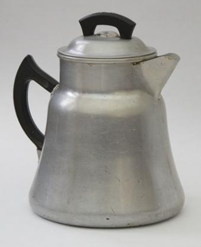
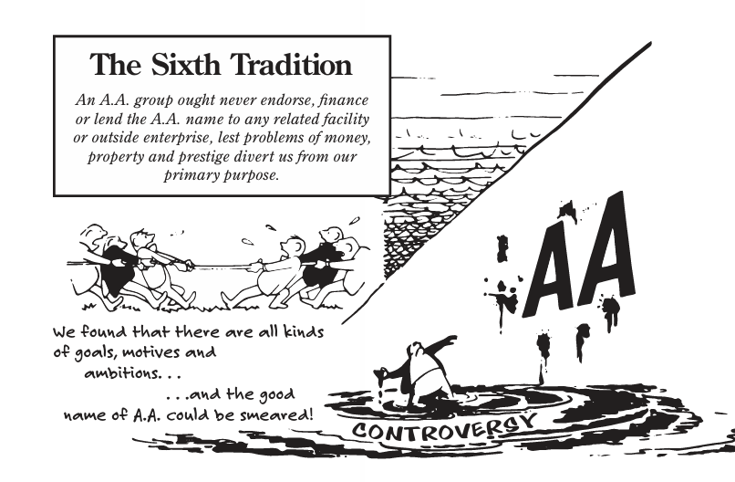
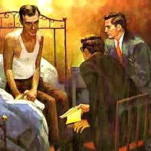
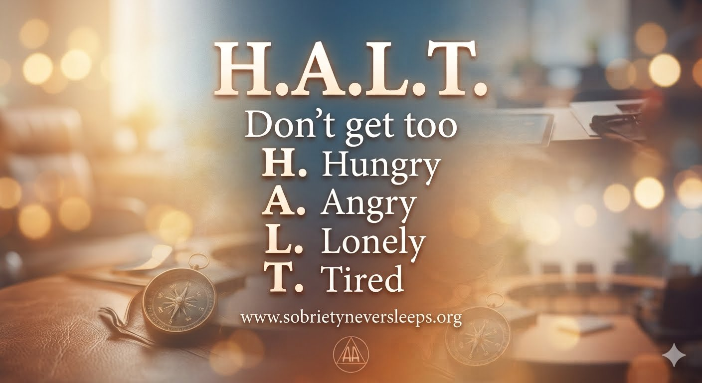
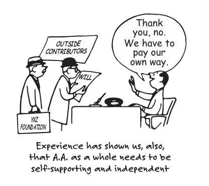

# Frequently Asked Questions About the 24/7 International Marathon Meeting of AA

<a class="join-button" href="https://zoom.us/j/2923712604" target="_blank" rel="noopener">Join Online AA Meeting</a>

If you are looking for quick answers about the meeting, the schedule, participation, or anonymity, this page brings together the most common questions we receive.

## Who is allowed to attend this 24-hour online AA meeting?

We are an open meeting of Alcoholics Anonymous. Anyone with a desire to stop drinking is welcome to participate, regardless of background, status, or location.

## Are members of the LGBTQ community welcome in this 24-hour AA meeting?

Yes. All alcoholics are welcome in the 24 Hour International Marathon Meeting of AA, regardless of their status, beliefs, lifestyle, or geographic location. Our Third Tradition states: "The only requirement for AA membership is a desire to stop drinking."

  

## When do the 24-hour online AA marathon meetings start?

A new meeting begins at the top of each hour, running continuously 24 hours a day, 7 days a week, 365 days a year.

## What time zone are the 24/7 AA Zoom meeting schedules based on?

The meetings run continuously around the clock. Because a new meeting starts at the top of each hour, it aligns perfectly with your time zone, no matter where you live in the world.

  

## What language is this 24/7 international AA Zoom meeting in?

English is the primary language of most members of the 24-Hour International Marathon Meeting of AA. However, everyone is welcome to participate, no matter their language. Online meetings in languages other than English can be found on the [Online Intergroup of AA website](https://aa-intergroup.org).

## What is the Zoom ID for the 24/7 International Marathon Meeting of AA?

The Zoom meeting ID is **292 371 2604**. No password is required to join. You can connect from anywhere in the world at any time.

To share your experience, strength, and hope, simply raise your virtual hand. The chairperson calls on hands in the exact order they are raised.

<a class="join-button" href="https://zoom.us/j/2923712604" target="_blank" rel="noopener">Join Online AA Meeting</a>

## Can I get a sponsor on this 24-hour marathon AA meeting?

Yes. The best way to get help in our meeting is to raise your virtual hand and let us know you are looking for a sponsor. We suggest that men work with men and women work with women.

## How can I get involved in service with this online recovery meeting?

We need chairpersons, timers, and greeters every hour. The Training Team holds regular training sessions. The host will provide details at the top of each hour. There is a monthly business meeting on the fourth Saturday of each month. The host will announce the business meeting at the top of each hour. To find out more about getting into service, send an email to the24hourmeeting@gmail.com.

  

## Can I just listen, or do I have to speak in this 24-hour online AA meeting?

You are completely welcome to just listen. Raise your virtual hand when you feel comfortable doing so. We want to get to know you.

## Do I have to introduce myself as an alcoholic to participate on this 24/7 AA Zoom meeting?

The 24 Hour International Marathon Meeting of AA is an open meeting of Alcoholics Anonymous. This means that everyone is welcome to listen. If you raise your virtual hand to share with us, we ask that you introduce yourself with your first name and let us know if you are an alcoholic or a person who has a desire to stop drinking.

  

*Alcoholics Anonymous began in Akron, Ohio, in June 1935, when Bill W., a New York stockbroker, met Dr. Bob, an Akron physician. Early AA pioneers gathered in Dr. Bob's house and drank from this coffee pot, as they shared their experience, strength and hope.*

## Do I need to turn on my video camera to participate on this 24-hour online AA meeting?

No. Having your video camera on is entirely optional.

## Is this 24-hour AA meeting affiliated with any church or religion?

No. Alcoholics Anonymous is not allied with any sect, denomination, politics, organization, or institution. While AA's Twelve Steps are spiritual in nature, AA is fully non-religious and open to individuals of all beliefs or no beliefs at all.

  

## Does AA provide medical and detox services or operate drug rehabilitation treatment centers?

No. Alcoholics Anonymous does not counsel problem drinkers or provide any medical advice. Nor does AA operate treatment centers or hospitals. AA's Eighth Tradition states: "Alcoholics Anonymous should remain forever nonprofessional, but our service centers may employ special workers."

  

## How is anonymity protected in a 24-hour online AA meeting?

Anonymity is the spiritual foundation of all AA's Traditions. You can protect your identity by changing your Zoom display name to your first name only, leaving your camera off, and sharing in a general way.

## What safety measures are in place for this online recovery meeting?

The 24 Hour International Marathon Meeting of AA follows the online safety suggestions provided by AA World Services. See the "Safety Card for AA Groups," "AA Guidelines on Internet," and "Anonymity Online and Digital Media" available at https://www.aa.org.

  

*The primary purpose of the 24-Hour International Marathon Meeting of Alcoholics Anonymous is to carry AA's life-saving message of hope and recovery to the alcoholic who still suffers.*

## Can I have my attendance verified for court or probation on this 24/7 AA Zoom meeting?

The 24 Hour International Marathon Meeting of AA does not provide attendance verification. However, attendance verification of online meetings is available on the [**NKC verification page**](https://newcomerskeepcoming.org/verification).

  

## Who runs AA?

The Second Tradition of Alcoholics Anonymous states: "For our group purpose there is but one ultimate authority--a loving God as He may express Himself in our group conscience. Our leaders are but trusted servants; they do not govern."

## How long does each person speak in this 24-hour online AA meeting?

Everyone who shares in the meeting gets five minutes to speak with a gentle reminder when there is one minute remaining.

  

## Is this an American meeting?

No. This is an international online AA meeting with participants from around the world. The meeting originated in New Zealand, but members are from many different countries.

## Are there young people in this online recovery meeting?

Yes. There are people of all ages on the 24 Hour International Marathon Meeting of AA, which is an open meeting of Alcoholics Anonymous. The only requirement for membership in AA is a desire to stop drinking.

  

## Are there any dues or fees required to join this 24-hour online AA meeting?

No. AA groups are supported by the voluntary contributions of their members.

## Can I speak about narcotics and other drugs on this 24/7 AA Zoom meeting?

In keeping with our primary purpose of carrying the AA message to the alcoholic who still suffers, we ask that everyone who shares confine their discussion to their problem with alcohol.

The long form of AA's Third Tradition states: "Our membership ought to include all who suffer from alcoholism. Hence we may refuse none who wish to recover. Nor ought AA membership ever depend upon money or conformity. Any two or three alcoholics gathered together for sobriety may call themselves an AA group, provided that, as a group, they have no other affiliation."

  
Long Form of AA's Tenth Tradition

  
No A.A. group or member should ever, in such a way as to implicate A.A., express any opinion on outside controversial issues--particularly those of politics, alcohol reform, or sectarian religion. The Alcoholics Anonymous groups oppose no one. Concerning such matters they can express no views whatever.

## How can I contact the 24-hour International Marathon Meeting of AA?

You can email the group at the24hourmeeting@gmail.com.

  

## Recovery Resources

[Explore Substance Abuse and Drug Rehabilitation Treatment Resources](recovery-resources.md)
