# 24/7 International Marathon Meeting of AA: 24/7 Online AA Meeting

<a id="join-meeting" class="join-button" href="https://zoom.us/j/2923712604" target="_blank" rel="noopener">Join Online AA Meeting</a>

Join a live 24/7 Online AA Meeting on Zoom. This is an open international Alcoholics Anonymous meeting with a new session every hour. Join now with Zoom Meeting ID **292 371 2604**. No password required.

## 24/7 AA Zoom Meeting

### Quick Answers

- **What is this?** A live 24/7 Online AA Meeting on Zoom for people seeking sobriety.
- **Who can attend?** This is an open Alcoholics Anonymous meeting, and anyone with a desire to stop drinking is welcome.
- **How do I join?** Use Zoom Meeting ID **292 371 2604** or click the Join Online AA Meeting button above.
- **Is a password required?** No. You can join without a password.
- **Who operates this website?** The Friends of 24/7 Recovery developed and maintain this website. We cooperate and network with Code for Recovery, a nonprofit organization that develops open-source technology projects to help the recovery community come together, get organized, and recover from alcoholism and addiction: [https://code4recovery.org](https://code4recovery.org). The Friends of 24/7 Recovery also networks with [Flying Sober 24-7](https://flying-sober.com/24-7-meetings) and [AA Directory.com](https://theaadirectory.com).

  

    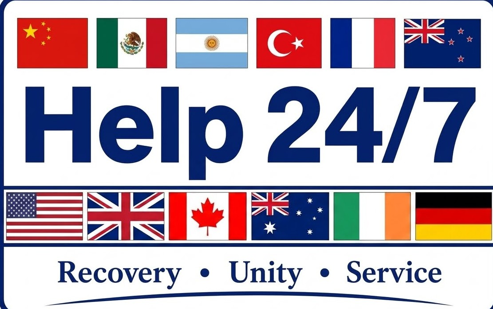
  

  <h3>International Online AA Zoom Meeting</h3>
  
The 24/7 International Marathon Meeting of AA is a continuous online Alcoholics Anonymous meeting available worldwide around the clock. A fresh meeting with a new AA topic begins at the top of each hour. We are an open meeting, and anyone with a desire to stop drinking is welcome to participate. Join anytime using Zoom Meeting ID <strong>292 371 2604</strong>. No password is needed.

  
Our online meeting has been running nonstop since April 20, 2020. It began at the start of the COVID-19 pandemic when two newcomers from New Zealand with cell phones realized they needed fellowship with other alcoholics to stay sober. The 24/7 International Marathon Meeting has carried AA's message of hope and recovery around the world ever since.

  

    
  

## Welcome to Online Recovery

  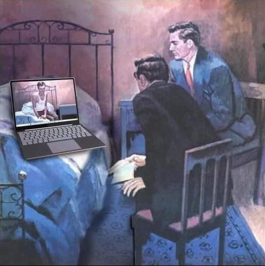

Welcome to the 24 Hour International Marathon Meeting of AA, *where sobriety never sleeps*. We are an open meeting of Alcoholics Anonymous, and everyone is welcome to listen. In keeping with AA's singleness of purpose and our Third Tradition, which states that the only requirement for AA membership is a desire to stop drinking, we ask that everyone who shares in our meeting confine their discussion to their problems with alcohol. You can join our online recovery meeting by clicking the "Join Online AA Meeting" button above or by joining the meeting through Zoom. The access code is **292 371 2604**. Join our online recovery meeting and raise your virtual hand. We want to get to know you, and experience has taught us that we can help best if you talk to us. We call on hands in the order they are raised, and everyone gets five minutes to share, with a gentle reminder when there is one minute remaining.

  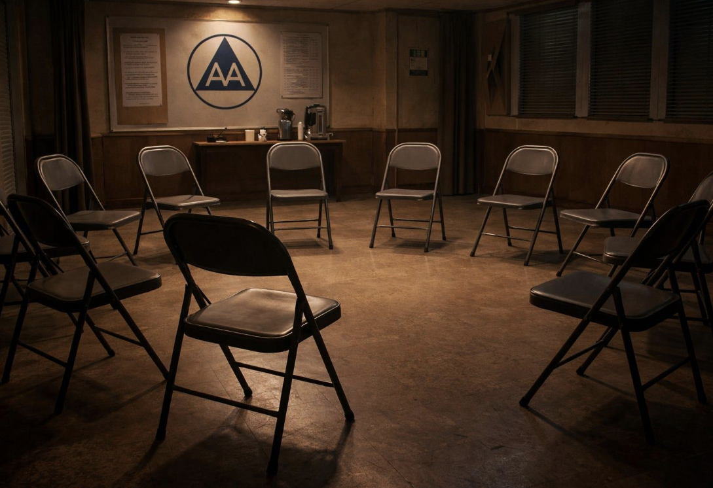

The 24 Hour International Marathon Meeting of AA, *where sobriety never sleeps*, is dedicated to carrying AA's life-saving message of hope and recovery globally to the alcoholic who still suffers. Individuals seeking support for drug problems and substance use disorders may benefit from professional treatment programs, government resources, rehabilitation services, family support organizations, and other recovery programs and fellowships. Alcoholics Anonymous is not affiliated with any outside agency or enterprise.

<a class="join-button" href="https://zoom.us/j/2923712604" target="_blank" rel="noopener">Join Online AA Meeting</a>

  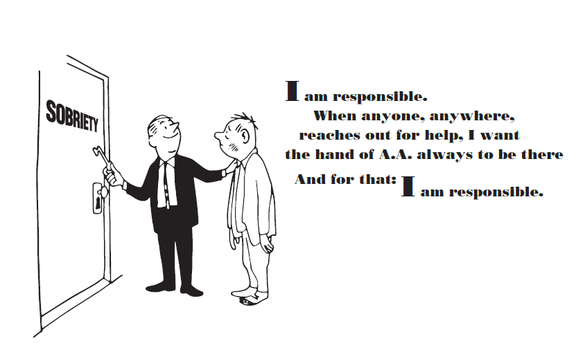

## Preamble

Alcoholics Anonymous is a fellowship of people who share their experience, strength, and hope with each other so that they may solve their common problem and help others recover from alcoholism. The only requirement for membership is a desire to stop drinking. There are no dues or fees for AA membership; we are self-supporting through our own contributions. AA is not allied with any sect, denomination, politics, organization, or institution; does not wish to engage in any controversy, neither endorses nor opposes any causes. Our primary purpose is to stay sober and help other alcoholics achieve sobriety.

*Copyright by AA Grapevine, Inc.; reprinted with permission.*

  

## The Twelve Steps

1. We admitted we were powerless over alcohol—that our lives had become unmanageable.
2. Came to believe that a Power greater than ourselves could restore us to sanity.
3. Made a decision to turn our will and our lives over to the care of God *as we understood Him*.
4. Made a searching and fearless moral inventory of ourselves.
5. Admitted to God, to ourselves, and to another human being the exact nature of our wrongs.
6. Were entirely ready to have God remove all these defects of character.
7. Humbly asked Him to remove our shortcomings.
8. Made a list of all persons we had harmed, and became willing to make amends to them all.
9. Made direct amends to such people wherever possible, except when to do so would injure them or others.
10. Continued to take personal inventory and when we were wrong promptly admitted it.
11. Sought through prayer and meditation to improve our conscious contact with God *as we understood Him*, praying only for knowledge of His will for us and the power to carry that out.
12. Having had a spiritual awakening as the result of these steps, we tried to carry this message to alcoholics, and to practice these principles in all our affairs.

  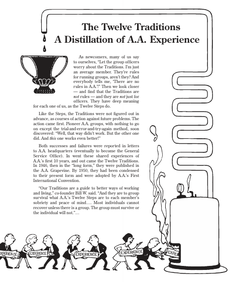

## The Twelve Traditions

1. Our common welfare should come first; personal recovery depends upon AA unity.
2. For our group purpose there is but one ultimate authority—a loving God as He may express Himself in our group conscience. Our leaders are but trusted servants; they do not govern.
3. The only requirement for AA membership is a desire to stop drinking.
4. Each group should be autonomous except in matters affecting other groups or AA as a whole.
5. Each group has but one primary purpose—to carry its message to the alcoholic who still suffers.
6. An AA group ought never endorse, finance, or lend the AA name to any related facility or outside enterprise, lest problems of money, property, and prestige divert us from our primary purpose.
7. Every AA group ought to be fully self-supporting, declining outside contributions.
8. Alcoholics Anonymous should remain forever nonprofessional, but our service centers may employ special workers.
9. AA, as such, ought never be organized; but we may create service boards or committees directly responsible to those they serve.
10. Alcoholics Anonymous has no opinion on outside issues; hence the AA name ought never be drawn into public controversy.
11. Our public relations policy is based on attraction rather than promotion; we need always maintain personal anonymity at the level of press, radio, and films.
12. Anonymity is the spiritual foundation of all our Traditions, ever reminding us to place principles before personalities.

  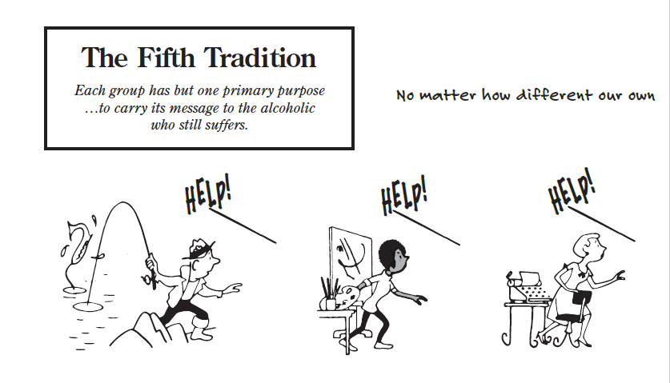
  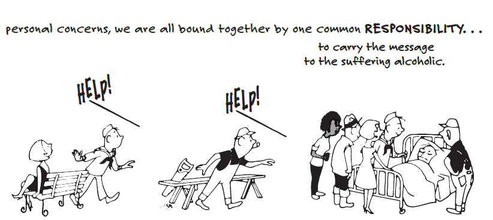

### A Declaration of Unity

  
Declaration of Unity

  
This we owe to AA's future: To place our common welfare first; to keep our Fellowship united. For on AA unity depend our lives and the lives of those to come.

  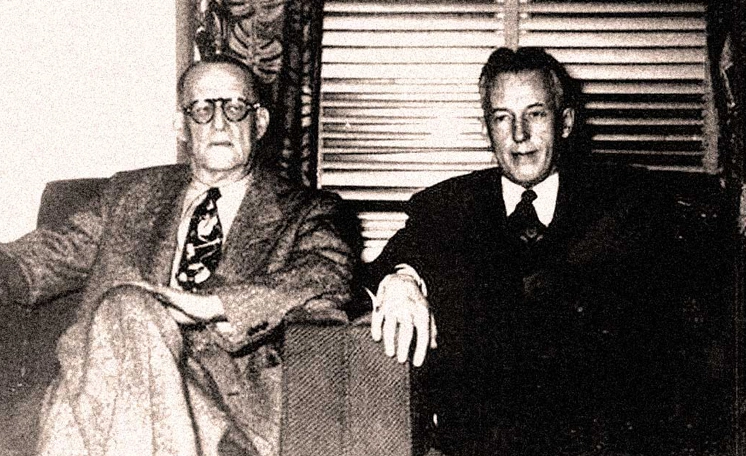

*Dr. Bob and Bill W., the cofounders of Alcoholics Anonymous*

### I Am Responsible

  
Toronto Responsibility Statement

  
I am responsible.

  
When anyone, anywhere, reaches out for help, I want the hand of AA always to be there. And for that I am responsible.

  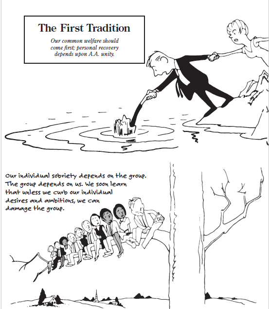

## Contact this 24/7 online AA Meeting

<a class="explore-button" href="contact-this-24-7-online-aa-meeting/">Contact this 24/7 online AA Meeting</a>

  

### International AA Websites

<a class="explore-button" href="international-aa-websites/">Explore International AA Websites</a>

  

## Do you have a drinking problem?

### The CAGE Questionnaire

The CAGE questionnaire is a short, widely used screening tool designed to help individuals identify possible problems with alcohol use. Originally introduced by Dr. John A. Ewing, it is commonly used in clinical settings and is recognized by institutions such as Johns Hopkins University Hospital.

Please answer each question honestly with a yes or no.

- C — Cut down: Have you ever felt you should cut down on your drinking?
- A — Annoyed: Have people annoyed you by criticizing your drinking?
- G — Guilty: Have you ever felt bad or guilty about your drinking?
- E — Eye-opener: Have you ever had a drink first thing in the morning to steady your nerves or relieve a hangover?

Source: [Johns Hopkins University Hospital](https://www.hopkinsmedicine.org)

  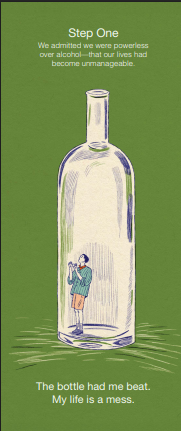

### AA's Two Questions

The book *Alcoholics Anonymous* (the Big Book) says that alcoholics are men and women who have lost the ability to control their drinking. AA does not pronounce anyone as being an alcoholic. The following passage from page 44 of the Big Book states: "In the preceding chapters you have learned something of alcoholism. We hope we have made clear the distinction between the alcoholic and the non-alcoholic. If, when you honestly want to, you find you cannot quit entirely, or if when drinking, you have little control over the amount you take, you are probably alcoholic. If that be the case, you may be suffering from an illness which only a spiritual experience will conquer."

  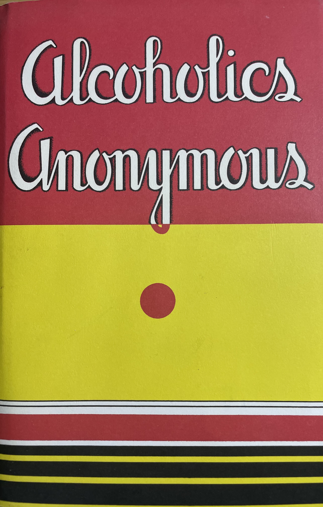

*First edition of the Big Book of Alcoholics Anonymous, first published in April 1939. This is our basic text, which explains the nature of alcoholism and AA's program of recovery--the Twelve Steps.*

## AA Literature

The button below leads to A.A. General Service Conference-approved literature.

<a class="explore-button" href="aa-literature/">Explore AA Literature</a>

  

## Crisis and Mental Health Resources

Alcoholics Anonymous is not affilated with any outside entities or organizations. The link below leads to Non-AA crisis and mental health resources.

<a class="explore-button" href="crisis-resources/">Explore Crisis and Mental Health Resources</a>

  

  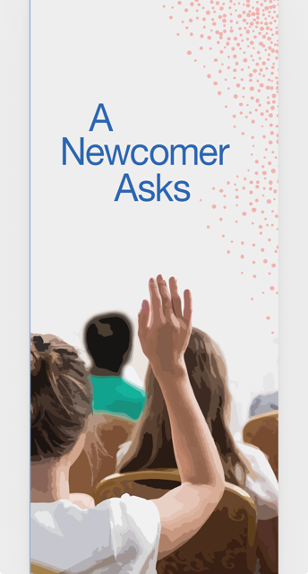

## Frequently Asked Questions

Need quick answers before joining? Visit our dedicated FAQ page for common questions about the meeting, attendance, safety, anonymity, and participation.

<a class="explore-button" href="faq/">Read the full FAQ</a>

To join right away, use the Zoom ID **292 371 2604** or click the button below:

<a class="join-button" href="https://zoom.us/j/2923712604" target="_blank" rel="noopener">Join Online AA Meeting</a>

## Recovery Resources

AA's Eighth Tradition states: "Alcoholics Anonymous should remain forever nonprofessional, but our service centers may employ special workers." The link below leads to a variety of non-AA recovery-related resources. Inclusion on this website does not indicate enorsement or affiliation. Our aim is to be helpful and to cooperate with our friends.

<a class="explore-button" href="recovery-resources/">Explore Substance Abuse and Drug Rehabilitation Treatment Resources</a>

  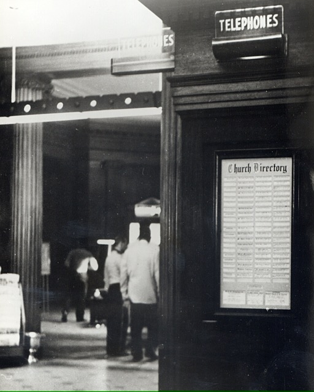
  
The church directory in the lobby of the Mayflower Hotel in Akron, Ohio that led Bill W. to Dr. Bob. The two men went on to co-found Alcoholics Anonymous.

## Topics for Online AA Meetings

The link below leads to possible topics for AA meetings. Other topics can be found in the pamphlet "The AA Group" and the book "As Bill Sees It." These titles, and many others are available at [www.aa.org](https://www.aa.org).

<a class="explore-button" href="topics-for-online-aa-meetings/">Explore Topics for Online AA Meetings</a>

  

## About This Meeting

The link below provides relevant information concerning the 24 Hour International Marathon Meeting of AA (Where sobriety never sleeps).

<a class="explore-button" href="about-this-meeting/">Learn About This Meeting</a>

  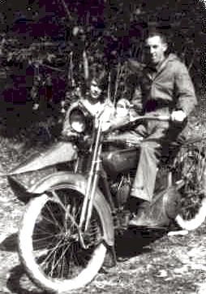
  
AA's cofounder, Bill W., and his wife Lois in 1925.

## Disclaimer and Permissions

For the full legal notice, permissions, and related guidance, see the page below.

<a class="explore-button" href="disclaimer-and-permissions/">Read Disclaimer and Permissions</a>

<a class="join-button" href="https://zoom.us/j/2923712604" target="_blank" rel="noopener">Join Online AA Meeting</a>

## Serenity Prayer

<blockquote style="font-family: Georgia, 'Times New Roman', serif; font-size: 1.25rem; line-height: 1.8; letter-spacing: 0.04em; font-style: italic; color: #2f3a3a; border-left: 3px solid #7a8d8d; padding-left: 1rem; margin: 1.5rem 0;">
God, grant me the <strong>Serenity</strong> to accept the things I cannot change, 
<strong>Courage</strong> to change the things I can, 
and <strong>Wisdom</strong> to know the difference.
</blockquote>

