# 24/7 International Marathon Meeting of A.A. — 24/7 Online A.A. Meeting

<a id="join-meeting" class="join-button" href="https://zoom.us/j/2923712604" target="_blank" rel="noopener">Join Online A.A. Meeting</a>

Join a live 24/7 Online A.A. Meeting on Zoom. This is an open international Alcoholics Anonymous meeting with a new session every hour. Join now with Zoom Meeting ID **292 371 2604**. No password required.

## 24 Hour International Marathon Meeting of A.A. (Where sobriety never sleeps)

  
  
The 24 Hour International Marathon Meeting of A.A. was founded at the start of the COVID pandemic by two newcomers from New Zealand who realized they needed the fellowship of other alcoholics if they were to stay sober. It has been operating continuously 24/7 since April 20, 2020.

  

### Quick Answers About this 24/7 Online A.A. Meeting

<a class="explore-button" href="quick-answers/">Read Quick Answers</a>

New to A.A.? Start with our <a href="aa-primary-purpose/">Primary Purpose</a> and <a href="aas-three-legacies/">Three Legacies</a> to understand the Fellowship's foundation.

  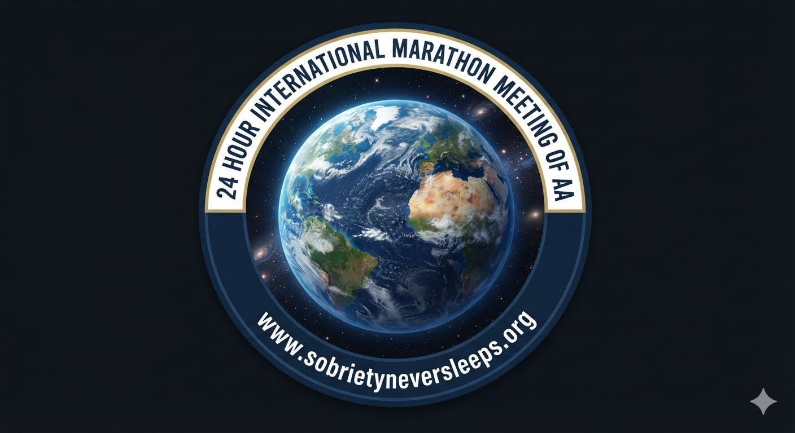

## What to Expect When You Join the 24 Hour International Marathon Meeting of A.A.

<a class="explore-button" href="what-to-expect-when-you-join/">Learn What to Expect</a>

  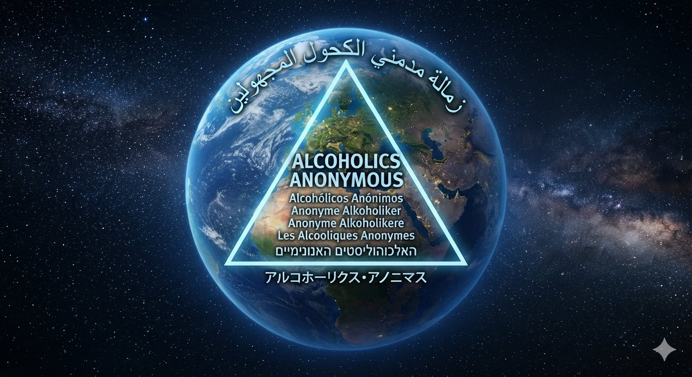

<a class="join-button" href="https://zoom.us/j/2923712604" target="_blank" rel="noopener">Join the Meeting Anytime</a>

## Welcome to Online Recovery

  

Welcome to the 24 Hour International Marathon Meeting of A.A., *where sobriety never sleeps*. We are an open meeting of Alcoholics Anonymous, and everyone is welcome to listen. In keeping with A.A.'s singleness of purpose and our Third Tradition, which states that the only requirement for A.A. membership is a desire to stop drinking, we ask that everyone who shares in our meeting confine their discussion to their problems with alcohol. You can join our online recovery meeting by clicking the "Join Online A.A. Meeting" button above or by joining the meeting through Zoom. The access code is **292 371 2604**. Join our online recovery meeting and raise your virtual hand. We want to get to know you, and experience has taught us that we can help best if you talk to us. We call on hands in the order they are raised, and everyone gets five minutes to share, with a gentle reminder when there is one minute remaining.

  

The 24 Hour International Marathon Meeting of A.A., *where sobriety never sleeps*, is dedicated to carrying A.A.'s life-saving message of hope and recovery globally to the alcoholic who still suffers. Individuals seeking support for drug problems and substance use disorders may benefit from professional treatment programs, government resources, rehabilitation services, family support organizations, and other recovery programs and fellowships. Alcoholics Anonymous is not affiliated with any outside agency or enterprise.

<a class="join-button" href="https://zoom.us/j/2923712604" target="_blank" rel="noopener">Join Online A.A. Meeting</a>

  

## Preamble

Alcoholics Anonymous is a fellowship of people who share their experience, strength, and hope with each other so that they may solve their common problem and help others recover from alcoholism. The only requirement for membership is a desire to stop drinking. There are no dues or fees for A.A. membership; we are self-supporting through our own contributions. A.A. is not allied with any sect, denomination, politics, organization, or institution; does not wish to engage in any controversy, neither endorses nor opposes any causes. Our primary purpose is to stay sober and help other alcoholics achieve sobriety.

*Copyright by A.A. Grapevine, Inc.; reprinted with permission.*

  

## The Twelve Steps

1. We admitted we were powerless over alcohol—that our lives had become unmanageable.
2. Came to believe that a Power greater than ourselves could restore us to sanity.
3. Made a decision to turn our will and our lives over to the care of God *as we understood Him*.
4. Made a searching and fearless moral inventory of ourselves.
5. Admitted to God, to ourselves, and to another human being the exact nature of our wrongs.
6. Were entirely ready to have God remove all these defects of character.
7. Humbly asked Him to remove our shortcomings.
8. Made a list of all persons we had harmed, and became willing to make amends to them all.
9. Made direct amends to such people wherever possible, except when to do so would injure them or others.
10. Continued to take personal inventory and when we were wrong promptly admitted it.
11. Sought through prayer and meditation to improve our conscious contact with God *as we understood Him*, praying only for knowledge of His will for us and the power to carry that out.
12. Having had a spiritual awakening as the result of these steps, we tried to carry this message to alcoholics, and to practice these principles in all our affairs.

  

## The Twelve Traditions

1. Our common welfare should come first; personal recovery depends upon A.A. unity.
2. For our group purpose there is but one ultimate authority—a loving God as He may express Himself in our group conscience. Our leaders are but trusted servants; they do not govern.
3. The only requirement for A.A. membership is a desire to stop drinking.
4. Each group should be autonomous except in matters affecting other groups or A.A. as a whole.
5. Each group has but one primary purpose—to carry its message to the alcoholic who still suffers.
6. An A.A. group ought never endorse, finance, or lend the A.A. name to any related facility or outside enterprise, lest problems of money, property, and prestige divert us from our primary purpose.
7. Every A.A. group ought to be fully self-supporting, declining outside contributions.
8. Alcoholics Anonymous should remain forever nonprofessional, but our service centers may employ special workers.
9. A.A., as such, ought never be organized; but we may create service boards or committees directly responsible to those they serve.
10. Alcoholics Anonymous has no opinion on outside issues; hence the A.A. name ought never be drawn into public controversy.
11. Our public relations policy is based on attraction rather than promotion; we need always maintain personal anonymity at the level of press, radio, and films.
12. Anonymity is the spiritual foundation of all our Traditions, ever reminding us to place principles before personalities.

  
  

### A Declaration of Unity

  
Declaration of Unity

  
This we owe to A.A.'s future: To place our common welfare first; to keep our Fellowship united. For on A.A. unity depend our lives and the lives of those to come.

  

*Dr. Bob and Bill W., the cofounders of Alcoholics Anonymous*

### I Am Responsible

  
Toronto Responsibility Statement

  
I am responsible.

  
When anyone, anywhere, reaches out for help, I want the hand of A.A. always to be there. And for that I am responsible.

  

## Contact the 24 Hour International Marathon Meeting of AA

This link will connect you with the 24 Hour International Marathon Meeting of A.A. (Where sobriety never sleeps).

  

<a class="explore-button" href="contact-this-24-7-online-aa-meeting/">Contact Us</a>

### International A.A. Websites

Alcoholics Anonymous is a global fellowship. The link below leads to many official international A.A. websites.

  

<a class="explore-button" href="international-aa-websites/">Explore International A.A. Websites</a>

  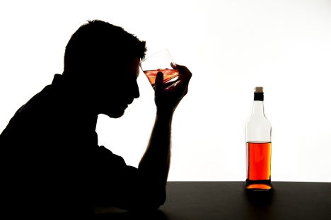

## Do you have a drinking problem?

### The CAGE Questionnaire

The CAGE questionnaire is a short, widely used screening tool designed to help individuals identify possible problems with alcohol use. Originally introduced by Dr. John A. Ewing, it is commonly used in clinical settings and is recognized by institutions such as Johns Hopkins University Hospital.

Please answer each question honestly with a yes or no.

- C — Cut down: Have you ever felt you should cut down on your drinking?
- A — Annoyed: Have people annoyed you by criticizing your drinking?
- G — Guilty: Have you ever felt bad or guilty about your drinking?
- E — Eye-opener: Have you ever had a drink first thing in the morning to steady your nerves or relieve a hangover?

Source: [Johns Hopkins University Hospital](https://www.hopkinsmedicine.org)

  
  
Alcoholics are women and men who have lost the ability to control their drinking. Recovery begins when we concede to our innermost selves that we are alcoholics.

### A.A.'s Two Questions

The book *Alcoholics Anonymous* (the Big Book) says that alcoholics are men and women who have lost the ability to control their drinking. A.A. does not pronounce anyone as being an alcoholic. The following passage from page 44 of the Big Book states: "In the preceding chapters you have learned something of alcoholism. We hope we have made clear the distinction between the alcoholic and the non-alcoholic. If, when you honestly want to, you find you cannot quit entirely, or if when drinking, you have little control over the amount you take, you are probably alcoholic. If that be the case, you may be suffering from an illness which only a spiritual experience will conquer."

  

*First edition of the Big Book of Alcoholics Anonymous, published in April 1939. This is our basic text, which explains the nature of alcoholism and A.A.'s program of recovery--the Twelve Steps.*

## A.A. Literature

The button below leads to A.A. General Service Conference-approved literature.

<a class="explore-button" href="aa-literature/">Access A.A. General Service Conference-approved Literature</a>

  

See also: <a href="aa-grapevine-and-la-vina/">A.A. Grapevine and La Viña</a> for member-written stories and insights.

  

## Crisis and Mental Health Resources

Alcoholics Anonymous is not affiliated with any outside entities or organizations. The link below leads to non-A.A. crisis and mental health resources.

<a class="explore-button" href="crisis-resources/">Access Crisis and Mental Health Support</a>

Also explore: <a href="recovery-resources/">Substance Abuse and Drug Rehabilitation Resources</a> and <a href="topics-for-online-aa-meetings/">Meeting Topics</a> for peer support.

## A Newcomer Asks

  

<a class="explore-button" href="https://www.aa.org/newcomer-asks" target="_blank" rel="noopener">Read the pamphlet &quot;A Newcomer Asks&quot; from A.A. World Services</a>

## Frequently Asked Questions

Need quick answers before joining? Visit our dedicated FAQ page for common questions about the meeting, attendance, safety, anonymity, and participation.

<a class="explore-button" href="faq/">Browse Frequently Asked Questions</a>

Related: <a href="quick-answers/">Quick Answers</a> | <a href="what-to-expect-when-you-join/">What to Expect</a>

To join right away, use the Zoom ID **292 371 2604** or click the button below:

<a class="join-button" href="https://zoom.us/j/2923712604" target="_blank" rel="noopener">Join Online A.A. Meeting</a>

## Recovery Resources

  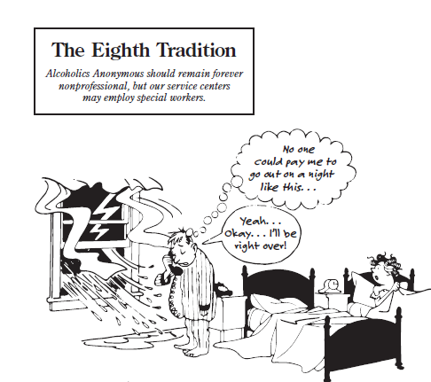
  

    
<strong>Long Form of Tradition Eight</strong>

    
Alcoholics Anonymous should remain forever nonprofessional. We define professionalism as the occupation of counseling alcoholics for fees or hire. But we may employ alcoholics where they are going to perform those services for which we might otherwise have to engage nonalcoholics. Such special services may be well recompensed. But our usual A.A. Twelfth Step work is never to be paid for.

  

A.A.'s Eighth Tradition states: "Alcoholics Anonymous should remain forever nonprofessional, but our service centers may employ special workers." The link below leads to a variety of non-A.A. recovery-related resources. Inclusion on this website does not indicate endorsement or affiliation. Our aim is to be helpful and to cooperate with our friends.

<a class="explore-button" href="recovery-resources/">Find Substance Abuse and Rehabilitation Resources</a>

Complement with: <a href="crisis-resources/">Crisis and Mental Health Resources</a>

  
  
The church directory in the lobby of the Mayflower Hotel in Akron, Ohio that led Bill W. to Dr. Bob. The two men went on to co-found Alcoholics Anonymous.

## Topics for Online A.A. Meetings

The link below leads to possible topics for A.A. meetings. Other topics can be found in the pamphlet "The A.A. Group" and the book "As Bill Sees It." These titles, and many others are available at [www.aa.org](https://www.aa.org).

<a class="explore-button" href="topics-for-online-aa-meetings/">View Meeting Topics and Discussion Ideas</a>

Read: <a href="aa-primary-purpose/">A.A.'s Primary Purpose</a> and <a href="aas-three-legacies/">Three Legacies</a> to ground your discussions.

  
  
Alcoholics Anonymous began in Akron, Ohio, in June 1935, when Bill W., a New York stockbroker, met Dr. Bob, an Akron physician. Early A.A. pioneers gathered in Dr. Bob's house and drank from this coffee pot, as they shared their experience, strength and hope.

## A.A.'s Primary Purpose

Our Twelfth Step -- carrying the message -- is the basic service that the A.A. Fellowship gives; this is our principal aim and the main reason for our existence. Therefore, A.A. is more than a set of principles; it is a society of alcoholics in action. We must carry the message, else we ourselves can wither and those who have not been given the truth may die. 

<a class="explore-button" href="aa-primary-purpose/">Learn About A.A.'s Primary Purpose</a>

Connection: <a href="aas-three-legacies/">A.A.'s Three Legacies</a> provide the framework for this purpose.

  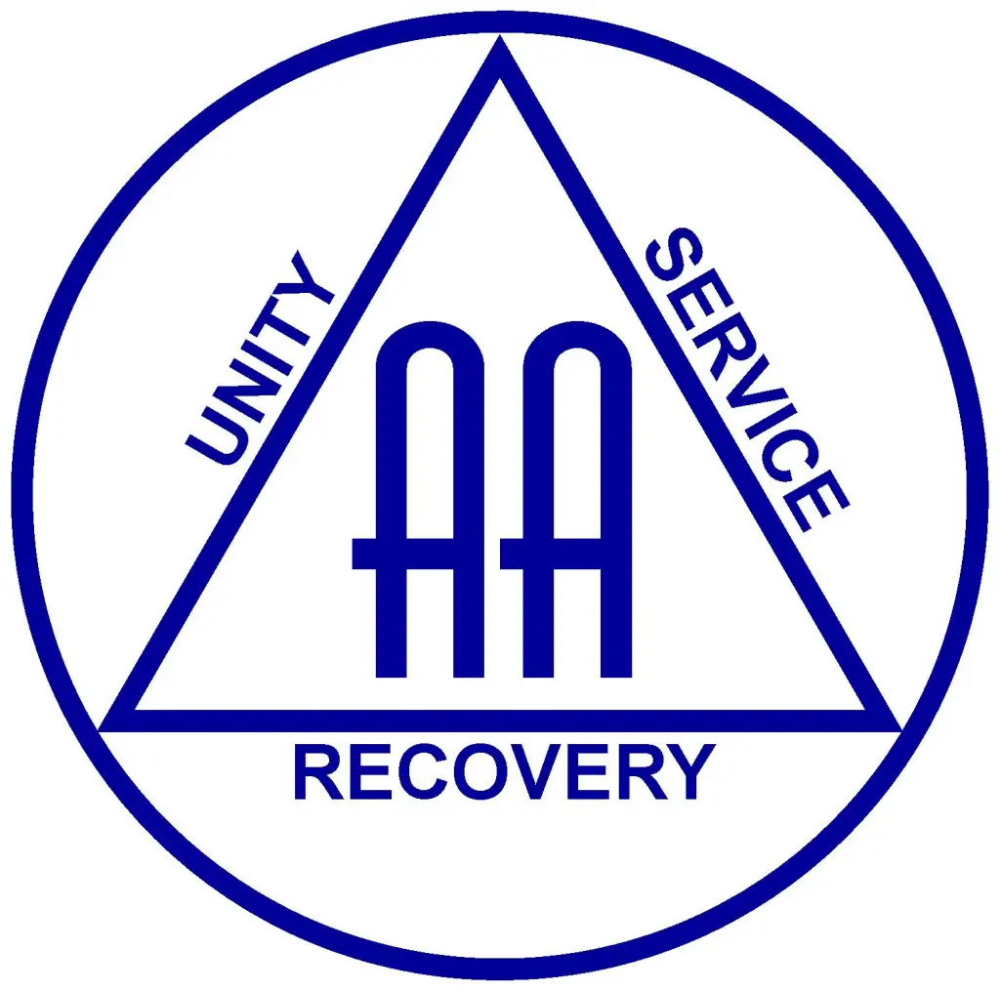

## A.A.'s Three Legacies: Recovery, Unity, and Service

The Three Legacies of Alcoholics Anonymous are Recovery, Unity, and Service. By the first, we recover from alcoholism; by the second, we stay together in unity; and by the third, our society functions and serves its primary purpose of carrying the A.A. message to all who need it and want it. (*Alcoholics Anonymous Comes of Age: A Brief History of A.A.*)

<a class="explore-button" href="aas-three-legacies/">Learn About A.A.'s Three Legacies</a>

  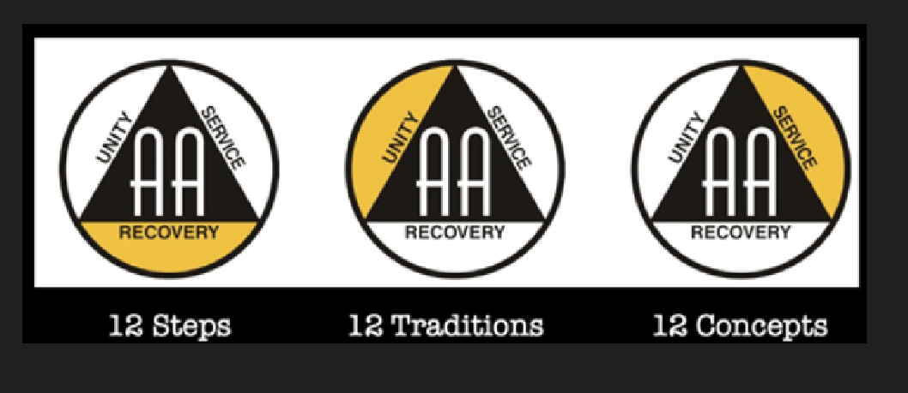
  
A.A.'s Three Legacies of Recovery, Unity, and Service were adopted by the Fellowship at the International Convention of Alcoholics Anonymous at St. Louis in 1955. Read about this historic event in the book <em>Alcoholics Anonymous Comes of Age: A Brief History of A.A.</em>

## Sponsorship

  
  
Sponsorship responsibility is unwritten and informal, but it is a basic part of the A.A. approach to recovery from alcoholism through the Twelve Steps. Sponsorship can be a longterm relationship.

<a class="explore-button" href="sponsorship/">Sponsorship</a>

<article class="legacy-vignette">
<h3>Sponsorship Within A.A.'s Three Legacies</h3>

The Three Legacies of Alcoholics Anonymous grew out of the individual and collective experience of A.A.'s early members as they struggled to gain, maintain and pass along the hard-won lessons of sobriety to other alcoholics. For these once-hopeless drinkers, the principles and the program of Alcoholics Anonymous provided the firm foundation for a new life based on the Twelve Steps, the Twelve Traditions and the Twelve Concepts. These principles continue to be vital foundations for countless alcoholics all over the world and in many languages. The Legacies of Recovery, Unity and Service — represented in the Steps, Traditions and Concepts — are interconnected and interdependent.

In meetings around the world, the metaphor of A.A. as a three-legged stool supported by the Three Legacies is often used. Remove one leg and the stool tips over. Without Recovery, as found in A.A.'s Twelve Steps, there would be no need for Unity. Without Unity, as supported by A.A.'s Twelve Traditions, groups would not survive, and there would be no need for Service. Without Service, as represented in A.A.'s Twelve Concepts, there would be no one available to carry the message, leaving Recovery unattainable to suffering alcoholics.

<h4>Recovery</h4>

The Twelve Steps provide the basis for recovery. First articulated in the Big Book, Alcoholics Anonymous, the Steps were written by A.A. co-founder Bill W. based on spiritual principles and practices from the fields of religion, medicine and psychology.

Reflecting upon these inspirations, Bill wrote, "The Oxford Groups of that day threw heavy emphasis on personal work, one member with another. A.A.'s Twelfth Step had its origin in that vital practice. The moral backbone of the 'O.G.' was absolute honesty, absolute purity, absolute unselfishness, and absolute love. They also practiced a type of confession, which they called 'sharing'; the making of amends for harms done they called 'restitution.' They believed deeply in their 'quiet time,' a meditation practiced by groups and individuals alike, in which the guidance of God was sought for every detail of living, great or small." (The Language of the Heart, page 196)

Bill noted that Dr. Silkworth "contribute[d] a very great idea without which A.A. could never have succeeded. For years he had been proclaiming alcoholism an illness, an obsession of the mind coupled with an allergy of the body ... That's where medical science, personified by this benign little doctor, began to fit in. Held in the hands of one alcoholic talking to the next, this double-edged truth was a sledgehammer which could shatter the tough alcoholic's ego at depth and lay him wide open to the grace of God."

Bill also wrote about contributions from psychology. "William James did even more. Not only, he [James] said, could spiritual experiences make people saner, they could transform men and women so that they could do, feel, and believe what had hitherto been impossible to them."

<h4>Unity</h4>

The Twelve Traditions were hammered out on the anvil of A.A. experience and presented to the Fellowship by Bill W. in 1946 through a series of articles in the AA Grapevine. Based on the trial-and-error experiences of A.A.'s early groups, Bill W. set out to write down what was working in the Fellowship and what was not. Major questions about membership, money and the relationship of one group to another threatened to crowd out the early success members were having in getting and staying sober. Recognizing the importance of unity within the newly formed Fellowship, Bill noted at one point that if all the rules and requirements in effect in different groups had been active across the entire Fellowship at the same time no one, including himself, would have qualified for membership. Bill called those early members "children of chaos," noting however, that having "defiantly played with every brand of fire," as a Fellowship they had emerged unharmed and wiser.

So, how do we hold the Fellowship together? How do we arrange ourselves with sufficient — but not too much — organization? How do we relate ourselves rightly with the outside world? How do we identify and stick to our singular purpose — that of carrying the message to the still-suffering alcoholic?

In Alcoholics Anonymous Comes of Age, Bill addressed the purpose fulfilled by the Twelve Traditions. "The Twelve Traditions ... point straight at many of our individual defects. By implication they ask each of us to lay aside pride and resentment. They ask for personal as well as group sacrifice. They ask us never to use the A.A. name in any quest for personal power or distinction or money. The Traditions guarantee the equality of all members and the independence of all groups. They show how we may best relate ourselves to each other and to the world outside. They indicate how we can best function in harmony as a great whole. For the sake of the welfare of our entire society, the Traditions ask that every individual and every group and every area in A.A. shall lay aside all desires, ambitions, and untoward actions that could bring serious division among us or lose for us the confidence of the world at large. The Twelve Traditions of Alcoholics Anonymous symbolize the sacrificial character of our life together and they are the greatest force for unity that we know."

<h4>Service</h4>

On a fateful day in November 1934, Bill W.'s old friend Ebby T. visited him in Brooklyn with hopeful news about recovery — "one alcoholic had effectively carried the message to another." This fundamental transmission of hope, repeated when Bill W. met Dr. Bob on Mother's Day in 1935, put into motion a chain reaction of recovery that continues to this day.

Initially dependent on the ongoing guidance of the co-founders, a service structure slowly grew up around early A.A.s that came to include the General Service Office, the General Service Board and the General Service Conference, the designated successor to the co-founders.

In his article in AA Grapevine titled "A.A.'s Legacy of Service," Bill remarked on this development: "Until 1950, these overall services were the sole function of a few old-time A.A.s, several nonalcoholic friends, Doctor Bob, and me. For all the years of A.A.'s infancy, we old-timers had been the self-appointed trustees for Alcoholics Anonymous.

At this time, we realized that A.A. had grown up, that our Fellowship was ready and able to take these responsibilities from us ... This meant that we had to form a conference representing our membership which could meet yearly with our Board of Trustees in New York and thus assume direct responsibility for the guardianship of A.A. tradition and the direction of our principal service affairs."

With the growth of the Conference and the ongoing evolution of A.A., in 1962 Bill put forward the Twelve Concepts for World Service, a set of principles bringing form and clarity to A.A.'s world service structure. As noted in their introduction, "These Concepts ... aim to record the 'why' of our service structure in such a fashion that the highly valuable experience of the past, and the lessons we have drawn from that experience, can never be forgotten or lost."

Bill summed it up this way in The Language of the Heart: "By our Twelve Steps we have recovered, by our Twelve Traditions we have unified, and through A.A.'s Third Legacy — Service — we shall carry the A.A. message down through all the corridors of time to come."

</article>

## Problems Other Than Alcohol

  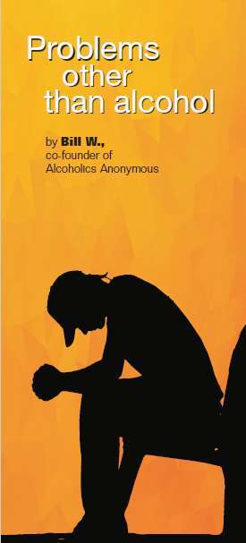

The problem of drug addiction in its several forms lies close to us all. It stirs our deepest interest and sympathy. Many A.A. members, especially those who have suffered these particular addictions, are now asking, "What can we do about drugs--within our Fellowship, and without?" Bill W. wrote these words in the pamphlet *Problems Other Than Alcohol*.

<a class="explore-button" href="problems-other-than-alcohol/">Problems Other Than Alcohol</a>

  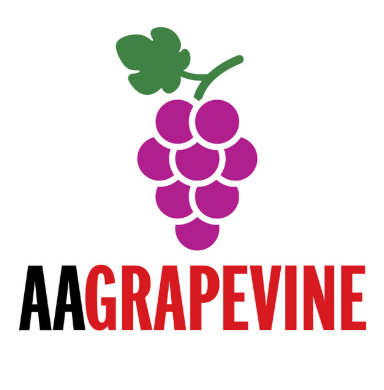
  
The Grapevine is A.A.'s "meeting in print." La Viña is the Fellowship's Spanish-language magazine. Both publications include submissions from ordinary A.A. members from around the world.

## A.A. Grapevine and La Vi&ntilde;a

### Welcome to the A.A. Grapevine and La Vi&ntilde;a

Welcome to your digital connection to **A.A. Grapevine** and **La Vi&ntilde;a**, the international journals of Alcoholics Anonymous. Often described as A.A.'s "meeting in print," these magazines provide a powerful monthly collection of stories, humor, and insights written directly by fellowship members worldwide.

Whether you are looking for daily inspiration, diverse perspectives on the Twelve Steps, or a deep dive into recovery history, Grapevine and La Vi&ntilde;a offer a wealth of shared experience, strength, and hope to support you on your journey - because here, sobriety never sleeps.

<a class="explore-button" href="aa-grapevine-and-la-vina/">Read A.A. Grapevine and La Viña Publications</a>

Explore: <a href="aa-literature/">A.A. Literature</a> | <a href="topics-for-online-aa-meetings/">Meeting Topics</a>

## About This 24 Hour Online Meeting

The link below provides relevant information concerning the 24 Hour International Marathon Meeting of A.A. (Where sobriety never sleeps).

<a class="explore-button" href="about-this-meeting/">Learn More About this 24 Hour International Marathon Meeting</a>

Connect with: <a href="aas-three-legacies/">A.A.'s Three Legacies</a> | <a href="aa-primary-purpose/">Primary Purpose</a>

  
  
A.A.'s cofounder, Bill W., and his wife Lois in 1925.

## A.A. World Services and A.A. General Service Office

<a class="explore-button" href="https://www.aa.org" target="_blank" rel="noopener">Contact the A.A. General Service Office (GSO)</a>

  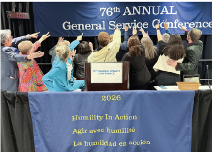
  
The General Service Conference of A.A. has become, for nearly every practical purpose, the active voice and the effective conscience of our whole society in its world affairs (Concept II). The workings of the Conference and the A.A. General Service structure are explained in the A.A. Service Manual and Twelve Concepts for World Service by Bill W. available at www.aa.org

  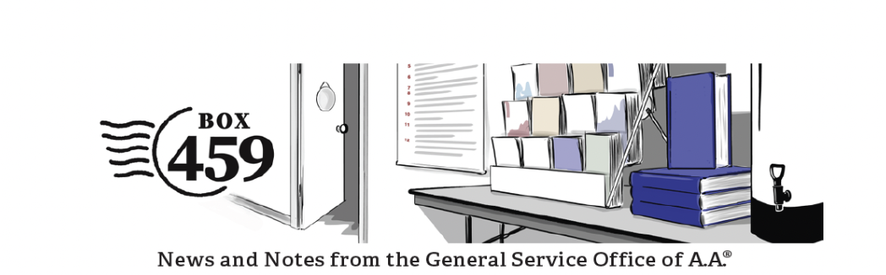
  
Box 459 is the official newsletter of the A.A. General Service Office.

## Box 459

Join our Box 459 newsletter digital delivery mailing list.

<a class="explore-button" href="https://www.aa.org/box-459" target="_blank" rel="noopener">Subscribe to Box 459 Newsletter</a>

  

## A.A. Around the World

<article class="legacy-vignette">
<h3>The World Service Meeting</h3>

Since its inauguration in 1969, the World Service Meeting (WSM) has provided an ongoing international forum for shared experience and ideas on carrying the A.A. message of recovery from alcoholism. Held biennially, the event alternates between New York and other locations around the globe, and has convened in such diverse cities as Cartagena, Colombia; Auckland, New Zealand; Oviedo, Spain; Malahide, Ireland; Mexico City, Mexico; Warsaw, Poland; and Durban, South Africa. Participating countries select delegates to attend this meeting.

The primary purpose of the World Service Meeting is the same as that of all A.A. activity: to carry the message of recovery to the alcoholic who still suffers, wherever in the world they may be, whatever language they may speak. The World Service Meeting seeks ways and means of accomplishing this goal by serving as a forum for sharing the experience, strength and hope of WSM delegates who come together every two years from all parts of the world.

Described as a living and growing exchange of experience responding to the needs of A.A. worldwide, WSM sessions cover a broad range of issues pertinent to the development of A.A. in participating countries.

</article>

<a class="explore-button" href="https://www.aa.org/28th-alcoholics-anonymous-world-service-meeting-final-report" target="_blank" rel="noopener">World Service Meeting Report</a>

## Disclaimer and Permissions

For the full legal notice, permissions, and related guidance, see the page below.

<a class="explore-button" href="disclaimer-and-permissions/">Read Our Disclaimer and Permissions</a>

  

<a class="join-button" href="https://zoom.us/j/2923712604" target="_blank" rel="noopener">Join Online A.A. Meeting</a>

---

  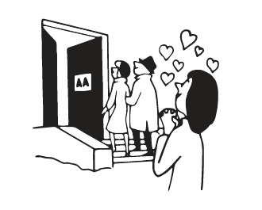

## Quick Links and Resources

  

    <h4>Getting Started</h4>
    <ul style="list-style: none; padding: 0; margin: 0;">
      <li style="margin: 0.5rem 0;"><a href="what-to-expect-when-you-join/">What to Expect</a></li>
      <li style="margin: 0.5rem 0;"><a href="quick-answers/">Quick Answers</a></li>
      <li style="margin: 0.5rem 0;"><a href="faq/">Frequently Asked Questions</a></li>
      <li style="margin: 0.5rem 0;"><a href="contact-this-24-7-online-aa-meeting/">Contact Us</a></li>
    </ul>
  

  

    <h4>A.A. Foundation</h4>
    <ul style="list-style: none; padding: 0; margin: 0;">
      <li style="margin: 0.5rem 0;"><a href="aa-primary-purpose/">Primary Purpose</a></li>
      <li style="margin: 0.5rem 0;"><a href="aas-three-legacies/">Three Legacies</a></li>
      <li style="margin: 0.5rem 0;"><a href="aa-literature/">Conference-Approved Literature</a></li>
      <li style="margin: 0.5rem 0;"><a href="international-aa-websites/">International Websites</a></li>
    </ul>
  

  

    <h4>Support & Resources</h4>
    <ul style="list-style: none; padding: 0; margin: 0;">
      <li style="margin: 0.5rem 0;"><a href="topics-for-online-aa-meetings/">Meeting Topics</a></li>
      <li style="margin: 0.5rem 0;"><a href="crisis-resources/">Crisis Resources</a></li>
      <li style="margin: 0.5rem 0;"><a href="recovery-resources/">Recovery Programs</a></li>
      <li style="margin: 0.5rem 0;"><a href="aa-grapevine-and-la-vina/">Grapevine & La Viña</a></li>
    </ul>
  

  

    <h4>About & Legal</h4>
    <ul style="list-style: none; padding: 0; margin: 0;">
      <li style="margin: 0.5rem 0;"><a href="about-this-meeting/">About This Meeting</a></li>
      <li style="margin: 0.5rem 0;"><a href="disclaimer-and-permissions/">Disclaimer</a></li>
      <li style="margin: 0.5rem 0;"><a href="https://www.aa.org" target="_blank" rel="noopener">A.A. World Services</a></li>
    </ul>
  

---

## Serenity Prayer

<blockquote style="font-family: Georgia, 'Times New Roman', serif; font-size: 1.25rem; line-height: 1.8; letter-spacing: 0.04em; font-style: italic; color: #2f3a3a; border-left: 3px solid #7a8d8d; padding-left: 1rem; margin: 1.5rem 0;">
God, grant me the <strong>Serenity</strong> to accept the things I cannot change, 
<strong>Courage</strong> to change the things I can, 
and <strong>Wisdom</strong> to know the difference.
</blockquote>

