# 24/7 International Marathon Meeting of AA: 24/7 Online AA Meeting

Join a live 24/7 Online AA Meeting on Zoom. This is an open international Alcoholics Anonymous meeting with a new session every hour. Join now with Zoom Meeting ID **292 371 2604**. No password required.

<a id="join-meeting" class="join-button" href="https://zoom.us/j/2923712604" target="_blank" rel="noopener">Join Online AA Meeting</a>

## 24/7 AA Zoom Meeting

### Quick Answers

- **What is this?** A live 24/7 Online AA Meeting on Zoom for people seeking sobriety.
- **Who can attend?** This is an open Alcoholics Anonymous meeting, and anyone with a desire to stop drinking is welcome.
- **How do I join?** Use Zoom Meeting ID **292 371 2604** or click the Join Online AA Meeting button above.
- **Is a password required?** No. You can join without a password.
- **Who operates this website?** The Friends of 24/7 Recovery developed and maintain this website. We cooperate and network with Code for Recovery, a nonprofit organization that develops open-source technology projects to help the recovery community come together, get organized, and recover from alcoholism and addiction: [https://code4recovery.org](https://code4recovery.org). The Friends of 24/7 Recovery also networks with [Flying Sober 24-7](https://flying-sober.com/24-7-meetings) and [AA Directory.com](https://theaadirectory.com).

  

    
  

  <h3>International Online AA Zoom Meeting</h3>
  
The 24/7 International Marathon Meeting of AA is a continuous online Alcoholics Anonymous meeting available worldwide around the clock. A fresh meeting with a new AA topic begins at the top of each hour. We are an open meeting, and anyone with a desire to stop drinking is welcome to participate. Join anytime using Zoom Meeting ID <strong>292 371 2604</strong>. No password is needed.

  
Our online meeting has been running nonstop since April 20, 2020. It began at the start of the COVID-19 pandemic when two newcomers from New Zealand with cell phones realized they needed fellowship with other alcoholics to stay sober. The 24/7 International Marathon Meeting has carried AA's message of hope and recovery around the world ever since.

  

    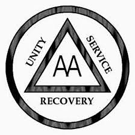
  

## Welcome to Online Recovery

  

Welcome to the 24 Hour International Marathon Meeting of AA, *where sobriety never sleeps*. We are an open meeting of Alcoholics Anonymous, and everyone is welcome to listen. In keeping with AA's singleness of purpose and our Third Tradition, which states that the only requirement for AA membership is a desire to stop drinking, we ask that everyone who shares in our meeting confine their discussion to their problems with alcohol. You can join our online recovery meeting by clicking the "Join Online AA Meeting" button above or by joining the meeting through Zoom. The access code is **292 371 2604**. Join our online recovery meeting and raise your virtual hand. We want to get to know you, and experience has taught us that we can help best if you talk to us. We call on hands in the order they are raised, and everyone gets five minutes to share, with a gentle reminder when there is one minute remaining.

The 24 Hour International Marathon Meeting of AA, *where sobriety never sleeps*, is dedicated to carrying AA's life-saving message of hope and recovery globally to the alcoholic who still suffers. Individuals seeking support for drug problems and substance use disorders may benefit from professional treatment programs, government resources, rehabilitation services, family support organizations, and other recovery programs and fellowships. Alcoholics Anonymous is not affiliated with any outside agency or enterprise.

  

## Preamble

Alcoholics Anonymous is a fellowship of people who share their experience, strength, and hope with each other so that they may solve their common problem and help others recover from alcoholism. The only requirement for membership is a desire to stop drinking. There are no dues or fees for AA membership; we are self-supporting through our own contributions. AA is not allied with any sect, denomination, politics, organization, or institution; does not wish to engage in any controversy, neither endorses nor opposes any causes. Our primary purpose is to stay sober and help other alcoholics achieve sobriety.

Copyright by AA Grapevine, Inc.; reprinted with permission.

  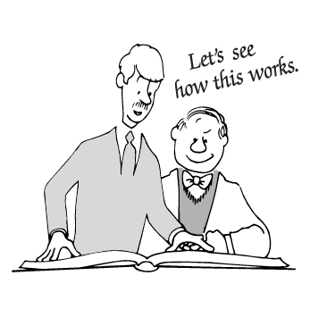

## The Twelve Steps

1. We admitted we were powerless over alcohol—that our lives had become unmanageable.
2. Came to believe that a Power greater than ourselves could restore us to sanity.
3. Made a decision to turn our will and our lives over to the care of God *as we understood Him*.
4. Made a searching and fearless moral inventory of ourselves.
5. Admitted to God, to ourselves, and to another human being the exact nature of our wrongs.
6. Were entirely ready to have God remove all these defects of character.
7. Humbly asked Him to remove our shortcomings.
8. Made a list of all persons we had harmed, and became willing to make amends to them all.
9. Made direct amends to such people wherever possible, except when to do so would injure them or others.
10. Continued to take personal inventory and when we were wrong promptly admitted it.
11. Sought through prayer and meditation to improve our conscious contact with God *as we understood Him*, praying only for knowledge of His will for us and the power to carry that out.
12. Having had a spiritual awakening as the result of these steps, we tried to carry this message to alcoholics, and to practice these principles in all our affairs.

  

## The Twelve Traditions

1. Our common welfare should come first; personal recovery depends upon AA unity.
2. For our group purpose there is but one ultimate authority—a loving God as He may express Himself in our group conscience. Our leaders are but trusted servants; they do not govern.
3. The only requirement for AA membership is a desire to stop drinking.
4. Each group should be autonomous except in matters affecting other groups or AA as a whole.
5. Each group has but one primary purpose—to carry its message to the alcoholic who still suffers.
6. An AA group ought never endorse, finance, or lend the AA name to any related facility or outside enterprise, lest problems of money, property, and prestige divert us from our primary purpose.
7. Every AA group ought to be fully self-supporting, declining outside contributions.
8. Alcoholics Anonymous should remain forever nonprofessional, but our service centers may employ special workers.
9. AA, as such, ought never be organized; but we may create service boards or committees directly responsible to those they serve.
10. Alcoholics Anonymous has no opinion on outside issues; hence the AA name ought never be drawn into public controversy.
11. Our public relations policy is based on attraction rather than promotion; we need always maintain personal anonymity at the level of press, radio, and films.
12. Anonymity is the spiritual foundation of all our Traditions, ever reminding us to place principles before personalities.

  
  

### A Declaration of Unity

  
Declaration of Unity

  
This we owe to AA's future: To place our common welfare first; to keep our Fellowship united. For on AA unity depend our lives and the lives of those to come.

### I Am Responsible

  
Toronto Responsibility Statement

  
I am responsible.

  
When anyone, anywhere, reaches out for help, I want the hand of AA always to be there. And for that I am responsible.

  

### Contact Us

  <ul>
    <li>Zoom: <strong>292 371 2604</strong> (no password needed). The meeting runs continuously 24 hours a day. Join the meeting and raise your virtual hand. We can help best if you speak with us.</li>
    <li>Email: the24hourmeeting@gmail.com</li>
    <li>Website: https://sobrietyneversleeps.org</li>
  </ul>

  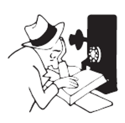

### International AA Websites

<ul>
  <li><strong>Online Intergroup of AA</strong>: <a href="https://aa-intergroup.org" target="_blank" rel="noopener">https://aa-intergroup.org</a></li>
  <li><strong>AA World Services</strong>: <a href="https://www.aa.org" target="_blank" rel="noopener">https://www.aa.org</a></li>
  <li><strong>Alcoholics Anonymous Great Britain</strong>: <a href="https://www.alcoholics-anonymous.org.uk" target="_blank" rel="noopener">https://www.alcoholics-anonymous.org.uk</a></li>
  <li><strong>Australia</strong>: <a href="https://aa.org.au" target="_blank" rel="noopener">https://aa.org.au</a></li>
  <li><strong>Aotearoa New Zealand</strong>: <a href="https://aa.org.nz" target="_blank" rel="noopener">https://aa.org.nz</a></li>
  <li><strong>Canada</strong>: <a href="https://www.aatoronto.org" target="_blank" rel="noopener">https://www.aatoronto.org</a></li>
  <li><strong>Continental European Region</strong>: <a href="https://alcoholics-anonymous.eu" target="_blank" rel="noopener">https://alcoholics-anonymous.eu</a></li>
  <li><strong>Spain</strong>: <a href="https://www.alcoholicos-anonimos.org" target="_blank" rel="noopener">https://www.alcoholicos-anonimos.org</a></li>
  <li><strong>Japan</strong>: <a href="https://aatokyo.org" target="_blank" rel="noopener">https://aatokyo.org</a></li>
  <li><strong>Ireland</strong>: <a href="https://alcoholicsanonymous.ie" target="_blank" rel="noopener">https://alcoholicsanonymous.ie</a></li>
  <li><strong>Mexico</strong>: <a href="https://aamexico.org.mx" target="_blank" rel="noopener">https://aamexico.org.mx</a></li>
  <li><strong>Argentina</strong>: <a href="https://aa.org.ar" target="_blank" rel="noopener">https://aa.org.ar</a></li>
  <li><strong>South Africa</strong>: <a href="https://aasouthafrica.org.za" target="_blank" rel="noopener">https://aasouthafrica.org.za</a></li>
  <li><strong>India</strong>: <a href="https://www.aagsoindia.org" target="_blank" rel="noopener">https://www.aagsoindia.org</a></li>
  <li><strong>Oregon (USA) Area 58, Online District 33</strong>: <a href="https://area58district33.org" target="_blank" rel="noopener">https://area58district33.org</a></li>
  <li><strong>Morocco</strong>: <a href="https://aamaroc.net" target="_blank" rel="noopener">https://aamaroc.net</a></li>
  <li><strong>AA Grapevine</strong>: <a href="https://www.aagrapevine.org" target="_blank" rel="noopener">https://www.aagrapevine.org</a></li>
  <li><strong>Virtual General Service Area of Alcoholics Anonymous</strong>: <a href="https://aavirtualarea.org.au" target="_blank" rel="noopener">https://aavirtualarea.org.au</a></li>
</ul>

  

## Do you have a drinking problem?

### The CAGE Questionnaire

The CAGE questionnaire is a short, widely used screening tool designed to help individuals identify possible problems with alcohol use. Originally introduced by Dr. John A. Ewing, it is commonly used in clinical settings and is recognized by institutions such as Johns Hopkins University Hospital.

Please answer each question honestly with a yes or no.

- C — Cut down: Have you ever felt you should cut down on your drinking?
- A — Annoyed: Have people annoyed you by criticizing your drinking?
- G — Guilty: Have you ever felt bad or guilty about your drinking?
- E — Eye-opener: Have you ever had a drink first thing in the morning to steady your nerves or relieve a hangover?

Source: [Johns Hopkins University Hospital](https://www.hopkinsmedicine.org)

  

### AA's Two Questions

The book *Alcoholics Anonymous* (the Big Book) says that alcoholics are men and women who have lost the ability to control their drinking. AA does not pronounce anyone as being an alcoholic. The following passage from page 44 of the Big Book states: "In the preceding chapters you have learned something of alcoholism. We hope we have made clear the distinction between the alcoholic and the non-alcoholic. If, when you honestly want to, you find you cannot quit entirely, or if when drinking, you have little control over the amount you take, you are probably alcoholic. If that be the case, you may be suffering from an illness which only a spiritual experience will conquer."

  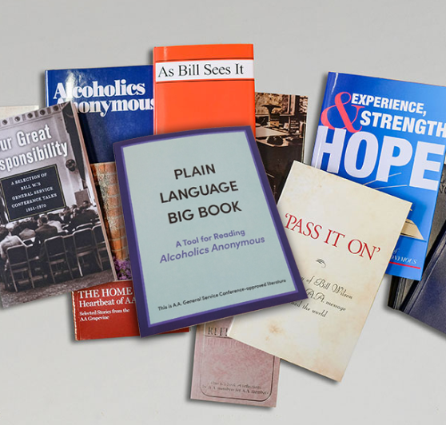

## AA Literature

Alcoholics Anonymous General Service Conference-approved literature is available on the AA World Services website, www.aa.org. Below is a list of suggested titles:

<a class="join-button" href="https://www.aa.org/resources/literature" target="_blank" rel="noopener">AA Literature</a>

### Books

- *Alcoholics Anonymous* (the Big Book)
- *Twelve Steps and Twelve Traditions*
- *Alcoholics Anonymous Comes of Age*
- *Living Sober* (practical suggestions from AA members)

### Pamphlets

- "Questions and Answers on Sponsorship"
- "Problems Other Than Alcohol"
- "The AA Group"
- "AA Tradition: How It Developed"
- "The Twelve Traditions Illustrated"

  

## Crisis and Mental Health Resources

Alcoholics Anonymous is not affiliated with any outside agency or organization. Below is a list of non-AA crisis resources. Inclusion of any non-AA resources does not suggest endorsement or affiliation.

If you or someone you know is in immediate danger, call emergency services right away or go to the nearest emergency department.

### Immediate crisis support

- United States and Puerto Rico: 988 Suicide & Crisis Lifeline — call or text 988, or visit [988lifeline.org](https://988lifeline.org)
- Canada: Talk Suicide Canada — call or text 45645, or visit [talksuicide.ca](https://talksuicide.ca)
- Canada: Wellness Together Canada — call 1-866-585-0455 or visit [wellness-together.ca](https://www.wellnesstogether.ca)
- United Kingdom: Samaritans — call 116 123 or visit [samaritans.org](https://www.samaritans.org)
- Australia: Lifeline Australia — call 13 11 14 or visit [lifeline.org.au](https://www.lifeline.org.au)
- New Zealand: Need to Talk? — call or text 1737 or visit [1737.org.nz](https://1737.org.nz)
- Substance Abuse and Mental Health Services Administration (SAMHSA) National Helpline (U.S.) — 1-800-662-HELP (4357) for treatment referrals and mental health or substance use support
- SAFE Project — domestic violence resources — [safeproject.us](https://www.safeproject.us)
- Befrienders Worldwide — global directory of crisis support services: [befrienders.org](https://www.befrienders.org)

  

## Frequently Asked Questions About the 24/7 International Marathon Meeting of AA

### Who is allowed to attend this 24-hour online AA meeting?

We are an open meeting of Alcoholics Anonymous. Anyone with a desire to stop drinking is welcome to participate, regardless of background, status, or location.

### Are members of the LGBTQ community welcome in this 24-hour AA meeting?

Yes. All alcoholics are welcome in the 24 Hour International Marathon Meeting of AA, regardless of their status, beliefs, lifestyle, or geographic location. Our Third Tradition states: "The only requirement for AA membership is a desire to stop drinking."

  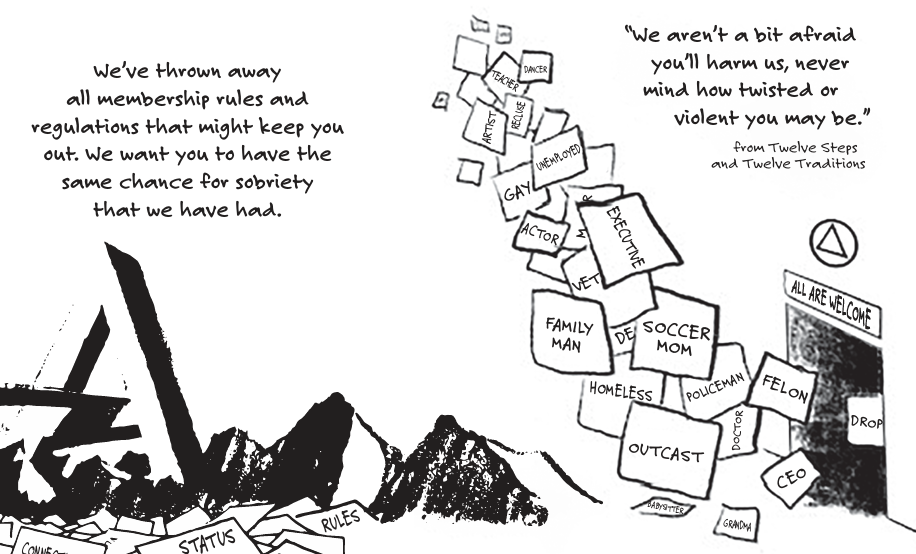

### When do the 24-hour online AA marathon meetings start?

A new meeting begins at the top of each hour, running continuously 24 hours a day, 7 days a week, 365 days a year.

### What time zone are the 24/7 AA Zoom meeting schedules based on?

The meetings run continuously around the clock. Because a new meeting starts at the top of each hour, it aligns perfectly with your time zone, no matter where you live in the world.

  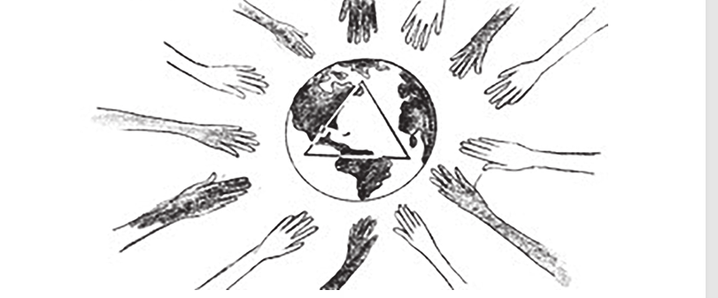

### What language is this 24/7 international AA Zoom meeting in?

English is the primary language of most members of the 24 Hour International Marathon Meeting of AA. However, everyone is welcome to participate, no matter their language. Online meetings in languages other than English can be found on the Online Intergroup of AA website: https://aa-intergroup.org

### What is the Zoom ID for the 24/7 International Marathon Meeting of AA?

The Zoom meeting ID is **292 371 2604**. No password is required to join. You can connect from anywhere in the world at any time.

To share your experience, strength, and hope, simply raise your virtual hand. The chairperson calls on hands in the exact order they are raised.

  

### Can I get a sponsor on this 24-hour marathon AA meeting?

Yes. The best way to get help in our meeting is to raise your virtual hand and let us know you are looking for a sponsor. We suggest that men work with men and women work with women.

### How can I get involved in service with this online recovery meeting?

We need chairpersons, timers, and greeters every hour. The Training Team holds regular training sessions. The host will provide details at the top of each hour. There is a monthly business meeting on the fourth Saturday of each month. The host will announce the business meeting at the top of each hour. To find out more about getting into service, send an email to the24hourmeeting@gmail.com.

  

### Can I just listen, or do I have to speak in this 24-hour online AA meeting?

You are completely welcome to just listen. Raise your virtual hand when you feel comfortable doing so. We want to get to know you.

### Do I have to introduce myself as an alcoholic to participate on this 24/7 AA Zoom meeting?

The 24 Hour International Marathon Meeting of AA is an open meeting of Alcoholics Anonymous. This means that everyone is welcome to listen. If you raise your virtual hand to share with us, we ask that you introduce yourself with your first name and let us know if you are an alcoholic or a person who has a desire to stop drinking.

### Do I need to turn on my video camera to participate on this 24-hour online AA meeting?

No. Having your video camera on is entirely optional.

### Is this 24-hour AA meeting affiliated with any church or religion?

No. Alcoholics Anonymous is not allied with any sect, denomination, politics, organization, or institution. While AA's Twelve Steps are spiritual in nature, AA is fully non-religious and open to individuals of all beliefs or no beliefs at all.

  

### Does AA provide medical and detox services or operate drug rehabilitation treatment centers?

No. Alcoholics Anonymous does not counsel problem drinkers or provide any medical advice. Nor does AA operate treatment centers or hospitals. AA's Eighth Tradition states: "Alcoholics Anonymous should remain forever nonprofessional, but our service centers may employ special workers."

  

### How is anonymity protected in a 24-hour online AA meeting?

Anonymity is the spiritual foundation of all AA's Traditions. You can protect your identity by changing your Zoom display name to your first name only, leaving your camera off, and sharing in a general way.

### What safety measures are in place for this online recovery meeting?

The 24 Hour International Marathon Meeting of AA follows the online safety suggestions provided by AA World Services. See the "Safety Card for AA Groups," "AA Guidelines on Internet," and "Anonymity Online and Digital Media" available at https://www.aa.org.

### Can I have my attendance verified for court or probation on this 24/7 AA Zoom meeting?

The 24 Hour International Marathon Meeting of AA does not provide attendance verification. However, attendance verification of online meetings is available on the [**NKC verification page**](https://newcomerskeepcoming.org/verification).

  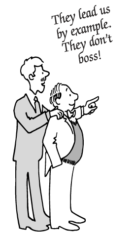

### Who runs AA?

The Second Tradition of Alcoholics Anonymous states: "For our group purpose there is but one ultimate authority--a loving God as He may express Himself in our group conscience. Our leaders are but trusted servants; they do not govern."

### How long does each person speak in this 24-hour online AA meeting?

Everyone who shares in the meeting gets five minutes to speak with a gentle reminder when there is one minute remaining.

### Is this an American meeting?

No. This is an international online AA meeting with participants from around the world. The meeting originated in New Zealand, but members are from many different countries.

### Are there young people in this online recovery meeting?

Yes. There are people of all ages on the 24 Hour International Marathon Meeting of AA, which is an open meeting of Alcoholics Anonymous. The only requirement for membership in AA is a desire to stop drinking.

  

### Are there any dues or fees required to join this 24-hour online AA meeting?

No. AA groups are supported by the voluntary contributions of their members.

### Can I speak about narcotics and other drugs on this 24/7 AA Zoom meeting?

In keeping with our primary purpose of carrying the AA message to the alcoholic who still suffers, we ask that everyone who shares confine their discussion to their problem with alcohol.

The long form of AA's Third Tradition states: "Our membership ought to include all who suffer from alcoholism. Hence we may refuse none who wish to recover. Nor ought AA membership ever depend upon money or conformity. Any two or three alcoholics gathered together for sobriety may call themselves an AA group, provided that, as a group, they have no other affiliation."

  
Long Form of AA's Tenth Tradition

  
No A.A. group or member should ever, in such a way as to implicate A.A., express any opinion on outside controversial issues--particularly those of politics, alcohol reform, or sectarian religion. The Alcoholics Anonymous groups oppose no one. Concerning such matters they can express no views whatever.

### How can I contact the 24-hour International Marathon Meeting of AA?

You can email the group at the24hourmeeting@gmail.com.

  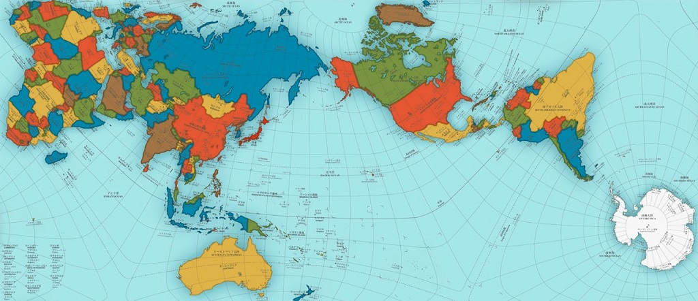

## Substance Abuse and Drug Rehabilitation Treatment Resources (Non-AA)

### International Drug Treatment, Rehabilitation & Recovery Resources

Alcoholics Anonymous is not affiliated with any outside enterprise. Inclusion of any non-AA resources does not suggest endorsement or affiliation. The following organizations provide treatment information, recovery resources, education, and referral services for individuals and families affected by substance abuse disorders. These organizations are independent and are not affiliated with Alcoholics Anonymous or the 24 Hour International Marathon Meeting of AA.

#### Global Drug Treatment and Recovery Organizations

- **World Health Organization (WHO)**: International guidance on substance use prevention, treatment, rehabilitation, and recovery. [https://www.who.int/health-topics/substance-use](https://www.who.int/health-topics/substance-use)
- **United Nations Office on Drugs and Crime (UNODC)**: Global drug treatment and rehabilitation resources. Supports evidence-based prevention, treatment, and recovery initiatives worldwide. [https://www.unodc.org/unodc/en/drug-prevention-and-treatment/](https://www.unodc.org/unodc/en/drug-prevention-and-treatment/)
- **International Society of Addiction Medicine (ISAM)**: Professional organization focused on addiction medicine, treatment standards, and education. [https://isamweb.org](https://isamweb.org)

#### Government and National Treatment Resources

- **New Zealand - Alcohol Drug Helpline**: Free confidential counseling and referrals. [https://alcoholdrughelp.org.nz](https://alcoholdrughelp.org.nz)
- **United States - SAMHSA National Helpline**: 24/7 confidential treatment and information service. Phone: 1-800-662-HELP (4357). [https://www.samhsa.gov](https://www.samhsa.gov)
- **United States - National Institute on Drug Abuse (NIDA)**: Research-based information on addiction treatment and recovery. [https://nida.nih.gov](https://nida.nih.gov)
- **Canada - Canadian Centre on Substance Use and Addiction (CCSA)**: National resource for prevention, treatment, and recovery information. [https://www.ccsa.ca](https://www.ccsa.ca)
- **United Kingdom - NHS Addiction Support Services**: National Health Service resource for drug and alcohol treatment. [https://www.nhs.uk/live-well/addiction-support](https://www.nhs.uk/live-well/addiction-support)
- **Australia - National Alcohol and Other Drug Hotline**: Information and referrals to local treatment services. [https://www.health.gov.au](https://www.health.gov.au)

- **European Union - European Union Drugs Agency (EUDA)**: Drug treatment information, data, and country resources across Europe. [https://www.euda.europa.eu](https://www.euda.europa.eu)

#### International 12-Step Recovery Programs

- **Narcotics Anonymous (NA)**: The world's largest 12-step fellowship for people seeking recovery from drug addiction. International meetings directory with online and in-person meetings available in numerous languages and countries. [https://www.na.org](https://www.na.org)
- **Cocaine Anonymous (CA)**: A 12-step fellowship for individuals recovering from cocaine addiction and other mind-altering substances. [https://ca.org](https://ca.org)
- **Crystal Meth Anonymous (CMA)**: A 12-step fellowship for people recovering from crystal meth addiction and other mind-altering substances. [https://www.crystalmeth.org](https://www.crystalmeth.org)
- **Marijuana Anonymous (MA)**: 12-step recovery fellowship for marijuana dependency. [https://marijuana-anonymous.org](https://marijuana-anonymous.org)
- **Heroin Anonymous (HA)**: Recovery support for individuals seeking freedom from heroin addiction. [https://heroinanonymous.org](https://heroinanonymous.org)
- **Pills Anonymous (PA)**: Support for people recovering from prescription drug dependency. [https://www.pillsanonymous.org](https://www.pillsanonymous.org)

#### Support for Families and Loved Ones Affected by Addiction

- **Nar-Anon Family Groups**: For family members and friends affected by another person's drug addiction. [https://www.nar-anon.org](https://www.nar-anon.org)
- **Families Anonymous**: Support groups for relatives and friends concerned with substance use and related behavioral issues. [https://www.familiesanonymous.org](https://www.familiesanonymous.org)
- **Al-Anon Family Groups**: Support for families and friends of people affected by alcoholism. [https://al-anon.org](https://al-anon.org)

#### Non-12-Step Recovery Programs for Addiction Recovery

- **SMART Recovery**: Secular mutual support program emphasizing self-management and evidence-based recovery tools. [https://smartrecovery.org](https://smartrecovery.org)
- **Came to Believe Recovery**: Find your freedom from addiction. Join a community that has recovered from a variety of addictions. Came to Believe Recovery acknowledges the Christian influence of early AA. The program is committed to helping others break free from addiction through spiritual retreats, workshops, and virtual meetings. It emphasizes the Four Absolutes of Honesty, Purity, Unselfishness, and Love as taught by the Oxford Groups that influenced the AA pioneers. [https://cametobelieverecovery.uk](https://cametobelieverecovery.uk)
- **LifeRing Secular Recovery**: Secular peer-to-peer support for addiction recovery. [https://lifering.org](https://lifering.org)
- **Recovery Dharma**: Recovery program based on Buddhist principles and practices. [https://recoverydharma.org](https://recoverydharma.org)
- **Women for Sobriety**: Recovery support organization focused on the unique needs of women. [https://womenforsobriety.org](https://womenforsobriety.org)
- **Celebrate Recovery**: A biblically based Christian approach to helping people achieve long-lasting recovery by healing hurts, guiding people toward new healthy truths, and developing life-giving habits. [https://celebraterecovery.com](https://celebraterecovery.com)

  
Long Form of AA's Eighth Tradition

  
Alcoholics Anonymous should remain forever nonprofessional. We define professionalism as the occupation of counseling alcoholics for fees or hire. But we may employ alcoholics where they are going to perform those services for which we might otherwise have to engage nonalcoholics. Such special services may be well recompensed. But our usual A.A. Twelfth Step work is never to be paid for.

## International University Programs in Drug and Alcohol Counselling

- **University of Auckland**: [https://www.auckland.ac.nz](https://www.auckland.ac.nz)
- **University of Southern Queensland**: [https://www.unisq.edu.au](https://www.unisq.edu.au)
- **Adelaide University**: [https://adelaide.edu.au](https://adelaide.edu.au)
- **London South Bank University**: [https://lsbu.ac.uk](https://lsbu.ac.uk)
- **University of the West of Scotland**: [https://uws.ac.uk](https://uws.ac.uk)
- **Queen's University Belfast**: [https://qub.ac.uk](https://qub.ac.uk)
- **Hazelden Betty Ford Graduate School**: [https://hazeldenbettyford.org](https://hazeldenbettyford.org)
- **University of Minnesota Twin Cities**: [https://umn.edu](https://umn.edu)
- **Virginia Commonwealth University**: [https://vcu.edu](https://vcu.edu)
- **Rutgers University**: [https://rutgers.edu](https://rutgers.edu)

## Professional Chemical Dependency Organizations

- **International Society of Substance Use Professionals (ISSUP)**: [https://issup.net](https://issup.net)
- **National Association of Alcoholism and Drug Abuse Counselors (NAADAC)**: [https://naadac.org](https://naadac.org)
- **Addiction Counselor Certification Board of California (ACCBC)**: [https://accbc.org](https://accbc.org)
- **Drug and Alcohol Practitioner's Association Aotearoa - New Zealand (DAPAANZ)**: [https://dapaanz.org.nz](https://dapaanz.org.nz)
- **Addiction Counsellors Ireland (ACI)**: [https://addictioncounsellors.ie](https://addictioncounsellors.ie)
- **Asia Pacific Association for Addiction Professionals (APAAP)**: [https://apaap.tungwahcsd.org](https://apaap.tungwahcsd.org)
- **Australian Alcohol and Other Drugs Council (AAODC)**: [https://aadc.org.au](https://aadc.org.au)
- **Canadian Addiction Counsellors Certification Federation (CACCF)**: [https://caccf.ca](https://caccf.ca)

  
Long Form of AA's Sixth Tradition

  
Problems of money, property, and authority may easily divert us from our primary spiritual aim. We think, therefore, that any considerable property of genuine use to A.A. should be separately incorporated and managed, thus dividing the material from the spiritual. An A.A. group, as such, should never go into business. Secondary aids to A.A., such as clubs or hospitals which require much property or administration, ought to be incorporated and so set apart that, if necessary, they can be freely discarded by the groups. Hence such facilities ought not to use the A.A. name. Their management should be the sole responsibility of those people who financially support them. For clubs, A.A. managers are usually preferred. But hospitals, as well as other places of recuperation, ought to be well outside A.A. and medically supervised. While an A.A. group may cooperate with anyone, such cooperation ought never go so far as affiliation or endorsement, actual or implied. An A.A. group can bind itself to no one.

  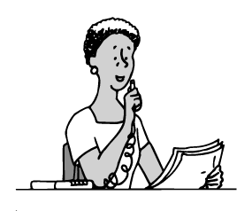

## Topics for Online AA Meetings

<ul class="topic-list">
  <li>Acceptance</li>
  <li>Surrender</li>
  <li>Honesty</li>
  <li>Open-mindedness</li>
  <li>Willingness</li>
  <li>Humility</li>
  <li>Responsibility</li>
  <li>Gratitude</li>
  <li>Patience</li>
  <li>Tolerance</li>
  <li>Forgiveness</li>
  <li>Compassion</li>
  <li>Faith</li>
  <li>Trust</li>
  <li>Letting go</li>
  <li>One day at a time</li>
  <li>Emotional sobriety</li>
  <li>Progress, not perfection</li>
  <li>Facing fear</li>
  <li>Handling resentment</li>
  <li>What is alcoholism?</li>
  <li>The AA Twelve-Step program of recovery</li>
  <li>The AA Preamble</li>
  <li>The Ninth Step Promises</li>
  <li>Sponsorship</li>
  <li>Home group commitment</li>
  <li>Anonymity</li>
  <li>Unity</li>
  <li>Service</li>
  <li>Carrying the message</li>
  <li>Relapse prevention</li>
  <li>Living sober</li>
  <li>Spiritual awakening</li>
  <li>Helping the newcomer</li>
  <li>Responsibility Declaration</li>
</ul>

  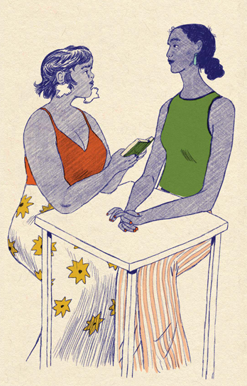

## About This Meeting

The 24-Hour International Marathon Meeting is a volunteer-run online meeting of Alcoholics Anonymous. The Fifth Tradition states: "Each group has but one primary purpose--to carry its message to the alcoholic who still suffers."

  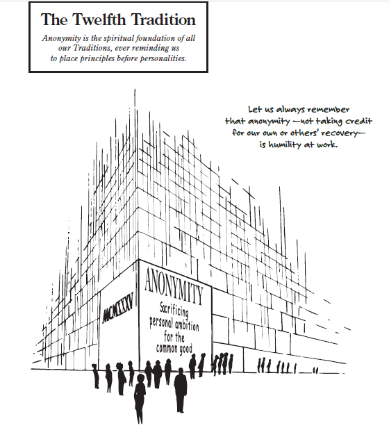

## Disclaimer

  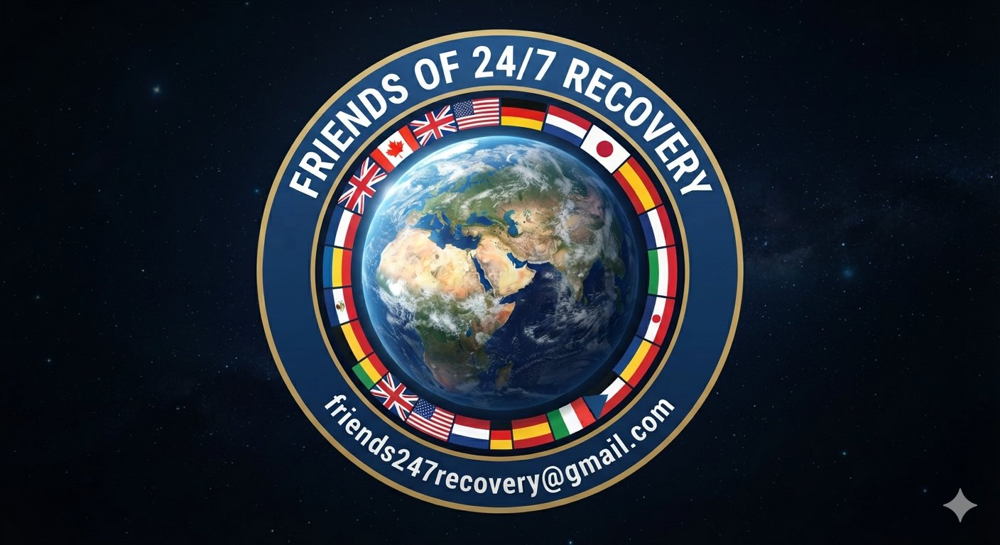

This website (https://sobrietyneversleeps.org) was independently and anonymously developed and is maintained by the Friends of 24/7 Recovery, which is solely responsible for its content. The Friends of 24/7 Recovery is a virtual international, non-affiliated, nonprofit organization based in New Zealand. Its members reside in many countries, including Canada, Australia, the United Kingdom, South Africa, and the United States. This website is not affiliated with or endorsed by the coordinators or GC of the 24 Hour International Marathon Meeting of AA.

The Friends of 24/7 Recovery is an independent volunteer para-organization collective dedicated to supporting the online recovery community. We cooperate and network with Code for Recovery, a nonprofit organization that develops open-source technology projects to help the recovery community come together, get organized, and recover from alcoholism and addiction: [https://code4recovery.org](https://code4recovery.org). The Friends of 24/7 Recovery also networks with [Flying Sober 24-7](https://flying-sober.com/24-7-meetings) and [AA Directory.com](https://theaadirectory.com).

In accordance with AA's traditions of non-affiliation and autonomy, the Friends of 24/7 Recovery is not affiliated with, sponsored by, or financially supported by Alcoholics Anonymous World Services, Inc. (AAWS), the General Service Board of Alcoholics Anonymous, the General Service Office of Alcoholics Anonymous, any local AA central or intergroup offices, or the coordinators or GC of the 24 Hour International Marathon Meeting of AA. While our collective supports an online recovery meeting that uses the Twelve Steps and Twelve Traditions of Alcoholics Anonymous, we do not speak for, represent, or receive endorsement from AA as a whole or from the coordinators or GC of the 24 Hour International Marathon Meeting of AA. We operate autonomously to help individuals connect with recovery resources. The primary purpose of this website is to assist anyone looking for an online AA marathon meeting. Our sole aim is to be helpful and to direct the still-suffering alcoholic to the life-saving Fellowship of Alcoholics Anonymous.

## Permissions
The Twelve Traditions of Alcoholics Anonymous, the images from "The Twelve Traditions Illustrated," and "The Twelve Steps Illustrated" are copyrighted intellectual property of Alcoholics Anonymous World Services, Inc. They are used here with permission.

## Serenity Prayer

<blockquote style="font-family: Georgia, 'Times New Roman', serif; font-size: 1.25rem; line-height: 1.8; letter-spacing: 0.04em; font-style: italic; color: #2f3a3a; border-left: 3px solid #7a8d8d; padding-left: 1rem; margin: 1.5rem 0;">
God, grant me the <strong>Serenity</strong> to accept the things I cannot change, 
<strong>Courage</strong> to change the things I can, 
and <strong>Wisdom</strong> to know the difference.
</blockquote>

