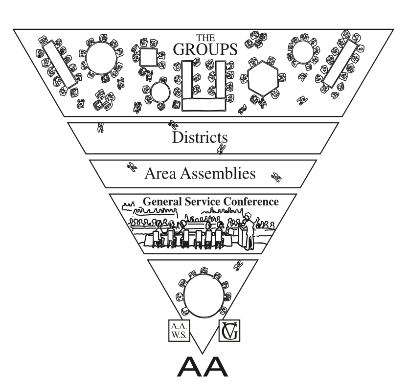

# 24 Hour International Marathon Meeting of AA

*Where sobriety never sleeps.*

  

    
  

  
The 24 HOUR INTERNATIONAL MARATHON MEETING OF ALCOHOLICS ANONYMOUS runs continuously around the world, around the clock. A fresh meeting begins at the top of each hour. We are an open meeting, and anyone with a desire to stop drinking is welcome to participate. We call on hands in the order they are raised. If you think you might have a drinking problem, click the button below.

  
Our online meeting has been running nonstop since the 20th of April 2020. At the commencement of the Covid pandemic, two newcomers from New Zealand with cell phones realized they needed fellowship with other alcoholics if they were to stay sober. The 24 Hour International Marathon Meeting has been carrying AA's life-saving message of hope and recovery ever since.

  <a id="join-meeting" class="join-button" href="https://zoom.com/j/2923712604" target="_blank" rel="noopener">Join Meeting</a>
  

    
  

## Preamble

Alcoholics Anonymous is a fellowship of people who share their experience, strength, and hope with each other so that they may solve their common problem and help others recover from alcoholism. The only requirement for membership is a desire to stop drinking. There are no dues or fees for AA membership; we are self-supporting through our own contributions. AA is not allied with any sect, denomination, politics, organization, or institution; does not wish to engage in any controversy, neither endorses nor opposes any causes. Our primary purpose is to stay sober and help other alcoholics achieve sobriety.

## The Twelve Steps

1. We admitted we were powerless over alcohol—that our lives had become unmanageable.
2. Came to believe that a Power greater than ourselves could restore us to sanity.
3. Made a decision to turn our will and our lives over to the care of God *as we understood Him*.
4. Made a searching and fearless moral inventory of ourselves.
5. Admitted to God, to ourselves, and to another human being the exact nature of our wrongs.
6. Were entirely ready to have God remove all these defects of character.
7. Humbly asked Him to remove our shortcomings.
8. Made a list of all persons we had harmed, and became willing to make amends to them all.
9. Made direct amends to such people wherever possible, except when to do so would injure them or others.
10. Continued to take personal inventory and when we were wrong promptly admitted it.
11. Sought through prayer and meditation to improve our conscious contact with God *as we understood Him*, praying only for knowledge of His will for us and the power to carry that out.
12. Having had a spiritual awakening as the result of these steps, we tried to carry this message to alcoholics, and to practice these principles in all our affairs.

## The Twelve Traditions

1. Our common welfare should come first; personal recovery depends upon AA unity.
2. For our group purpose there is but one ultimate authority—a loving God as He may express Himself in our group conscience. Our leaders are but trusted servants; they do not govern.
3. The only requirement for AA membership is a desire to stop drinking.
4. Each group should be autonomous except in matters affecting other groups or AA as a whole.
5. Each group has but one primary purpose—to carry its message to the alcoholic who still suffers.
6. An AA group ought never endorse, finance, or lend the AA name to any related facility or outside enterprise, lest problems of money, property, and prestige divert us from our primary purpose.
7. Every AA group ought to be fully self-supporting, declining outside contributions.
8. Alcoholics Anonymous should remain forever nonprofessional, but our service centers may employ special workers.
9. AA, as such, ought never be organized; but we may create service boards or committees directly responsible to those they serve.
10. Alcoholics Anonymous has no opinion on outside issues; hence the AA name ought never be drawn into public controversy.
11. Our public relations policy is based on attraction rather than promotion; we need always maintain personal anonymity at the level of press, radio, and films.
12. Anonymity is the spiritual foundation of all our Traditions, ever reminding us to place principles before personalities.

### A Declaration of Unity

  
Declaration of Unity

  
This we owe to AA's future: To place our common welfare first; to keep our Fellowship united. For on AA unity depend our lives and the lives of those to come.

### I am responsible...

  
Toronto Responsibility Statement

  
I am responsible.

  
When anyone, anywhere, reaches out for help, I want the hand of AA always to be there. And for that I am responsible.

### Contact Us

  <ul>
    <li>Zoom: 292 371 2604 (no password needed) The meeting runs continuously 24 hours a day. Join the meeting and raise your virtual hand. We can help best if you talk to us.</li>
    <li>Email: the24hourmeeting@gmail.com</li>
    <li>Website: https://sobrietyneversleeps.org</li>
  </ul>

### International AA Websites

<ul>
  <li><strong>Online Intergroup of AA</strong>: https://aa-intergroup.org</li>
  <li><strong>AA World Services</strong>: https://www.aa.org</li>
  <li><strong>Alcoholics Anonymous Great Britain</strong>: https://www.alcoholics-anonymous.org.uk</li>
  <li><strong>Australia</strong>: https://aa.org.au</li>
  <li><strong>Aotearoa New Zealand</strong>: https://aa.org.nz</li>
  <li><strong>Canada</strong>: www.aatoronto.org</li>
  <li><strong>Continental European Region</strong>: https://alcoholics-anonymous.eu</li>
  <li><strong>Spain</strong>: www.alcoholicos-anonimos.org</li>
  <li><strong>Japan</strong>: https://aatokyo.org</li>
  <li><strong>Ireland</strong>: https://alcoholicsanonymous.ie</li>
  <li><strong>Mexico</strong>: http://aamexico.org.mx</li>
  <li><strong>Argentina</strong>: https://aa.org.ar</li>
  <li><strong>South Africa</strong>: https://aasouthafrica.org.za</li>
  <li><strong>India</strong>: https://www.aagsoindia.org</li>
  <li><strong>Oregon (USA) Area 58, Online District 33</strong>: https://area58district33.org</li>
  <li><strong>Morocco</strong>: https://aamaroc.net</li>
</ul>

  

