# 24-Hour International Marathon Meeting of A.A. Online — 24/7 Online A.A. Meeting

Join a live 24/7 Online A.A. Meeting on Zoom. This is an open international Alcoholics Anonymous meeting with a new session every hour. Join now with Zoom Meeting ID **292 371 2604**. No password required.

<a id="join-meeting" class="join-button home-join-button" href="https://zoom.us/j/2923712604" target="_blank" rel="noopener">Join this 24/7 online A.A. meeting NOW</a>

<nav class="home-section-index" aria-label="On this page">
  <strong>On this page</strong>
  <a href="#quick-answers-about-this-247-online-aa-meeting">Quick answers</a>
  <a href="#what-to-expect-when-you-join-this-24-hour-aa-meeting-on-zoom">What to expect</a>
  <a href="#are-you-new-to-alcoholics-anonymous">New to A.A.</a>
  <a href="#find-aa-near-you">Find A.A.</a>
  <a href="#do-you-have-a-drinking-problem">Drinking problem</a>
  <a href="#crisis-and-mental-health-resources">Crisis resources</a>
  <a href="#recovery-resources">Recovery resources</a>
</nav>

## Where Sobriety Never Sleeps

*The 24-Hour International Marathon Meeting of A.A. Online was founded at the start of the COVID pandemic by two newcomers from New Zealand who realized they needed the fellowship of other alcoholics if they were to stay sober. It has been operating continuously 24/7 since April 20, 2020.*

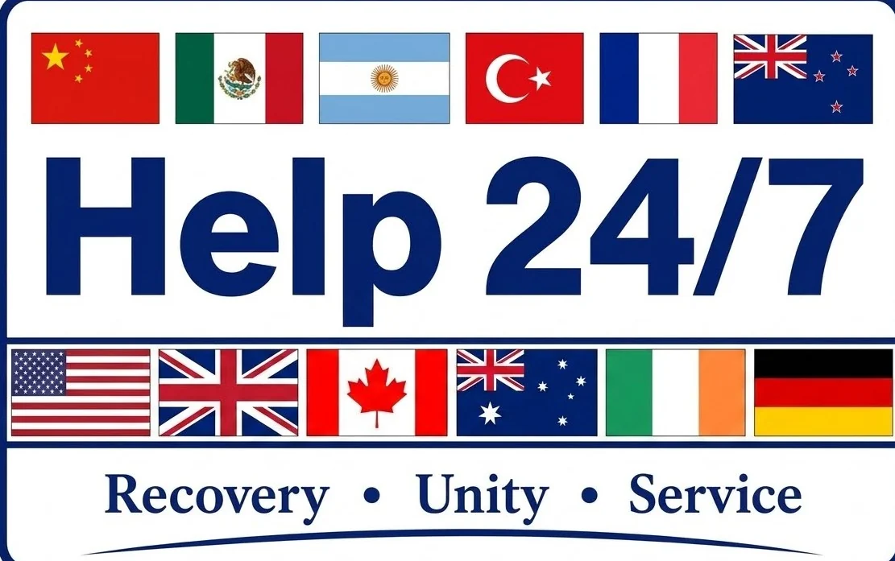{ loading=lazy decoding=async }

<em>The 24-Hour International Marathon Meeting of A.A. (where sobriety never sleeps) is a continuous 24/7 online A.A. meeting on Zoom: an international Alcoholics Anonymous marathon meeting with a new session every hour. Join now with Zoom Meeting ID <strong class="zoom-meeting-id">292 371 2604</strong>. No password required.</em>

## Online Intergroup of A.A. (OIAA)

<section class="help-vignette" aria-labelledby="help-now-heading">
<h2 id="help-now-heading">Get Help Now from OIAA 12th Step Committee</h2>

<a class="help-button" href="https://aa-intergroup.org/get-help-now/" target="_blank" rel="noopener">Get Help Now</a>

  
<strong>Can’t Stop Drinking?</strong>

  
If you want to stop drinking and you’re having trouble doing it, you’re in the right place.

  
Alcoholics Anonymous connects people who <em>want</em> to stop drinking with support from others who understand the struggle. All you need is a desire to stop drinking.

  
If you’re looking for help right now, the link above will connect you with the <strong>Online Intergroup of Alcoholics Anonymous (OIAA) 12th Step Committee</strong>, where you can reach sober members who understand what you’re going through. A.A. members from around the world who speak many different languages are available to help right now.

</section>

## Are You New to Alcoholics Anonymous?

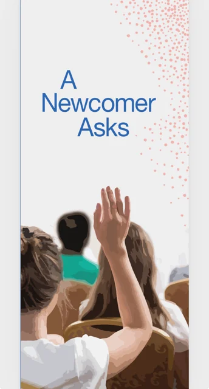{ loading=lazy decoding=async }

<a class="explore-button" href="https://www.aa.org/newcomer-asks" target="_blank" rel="noopener">Read the pamphlet &quot;A Newcomer Asks&quot; from A.A. World Services</a>

<em>Alcoholics Anonymous is a fellowship of people who come together to solve their drinking problem. It doesn’t cost anything to attend A.A. meetings. There are no age or education requirements to participate. Membership is open to anyone who wants to do something about their drinking problem. A.A.’s primary purpose is to help alcoholics to achieve sobriety.</em>

### Frequently Asked Questions About A.A.

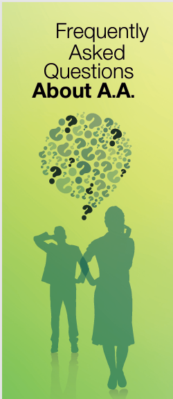{ loading=lazy decoding=async }

<a class="explore-button" href="https://aaws.widen.net/content/qbwy1oqmao/pdf/p-2_frequently_asked_questions_online.pdf?v=0669bdcf-3d9a-447d-a3d5-058d1ecec038" target="_blank" rel="noopener">Frequently Asked Questions About A.A.</a>

<em>A.A.’s Twelve Steps are a set of spiritual principles. When practiced as a way of life, they can expel the obsession to drink and enable the sufferer to recover from alcoholism. The Twelve Traditions apply to A.A. as a whole. They outline how A.A. maintains its unity and relates itself to the world around it. The book <i>Alcoholics Anonymous</i> describes the A.A. program of recovery. It also contains stories written by the co-founders and stories from a wide range of members who have found recovery in A.A.</em>

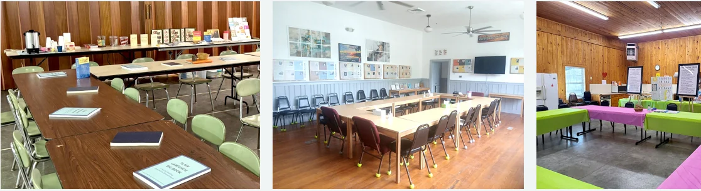{ loading=lazy decoding=async }

### Quick Answers About This 24/7 Online A.A. Meeting

<a class="explore-button" href="quick-answers/">Read Quick Answers</a>

New to A.A.? Start with our <a href="aa-primary-purpose/">Primary Purpose</a> and <a href="aas-three-legacies/">Three Legacies</a> to understand the Fellowship's foundation.

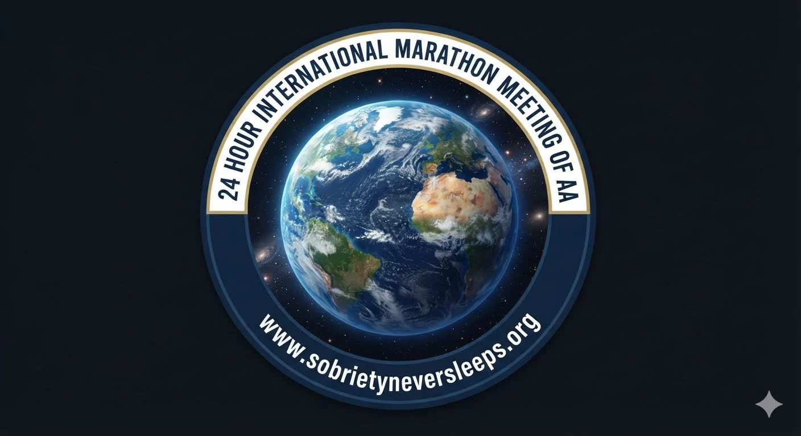{ loading=lazy decoding=async }

*The 24-Hour International Marathon Meeting of A.A. is an open, continuous, 24/7 online Alcoholics Anonymous meeting. A new A.A. meeting with a fresh recovery topic begins every hour, making it easy for newcomers to find an online A.A. meeting anytime—day or night.*

## What to Expect When You Join This 24-Hour A.A. Meeting on Zoom

<a class="explore-button" href="what-to-expect-when-you-join/">Learn What to Expect</a>

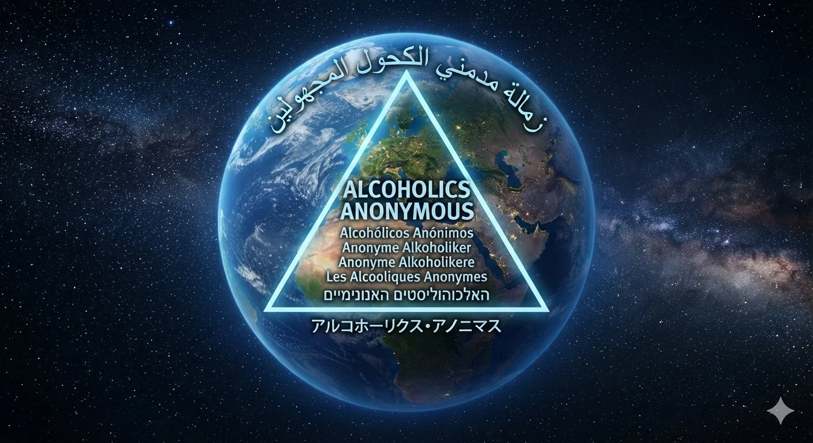{ loading=lazy decoding=async }

*This 24/7 online A.A. meeting is an open Alcoholics Anonymous meeting. Everyone is welcome to listen, and we ask that only alcoholics or those with a desire to stop drinking share.*

## Welcome to Online Recovery

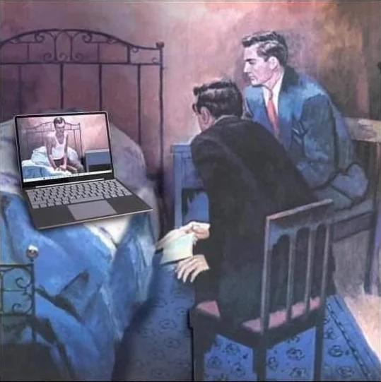{ loading=lazy decoding=async }

Welcome to the 24-Hour International Marathon Meeting of A.A., *where sobriety never sleeps*. We are an open online Alcoholics Anonymous meeting for people looking for an A.A. meeting, recovery support, or a welcoming place to connect with others who understand alcoholism. In keeping with A.A.'s singleness of purpose and our Third Tradition, which states that the only requirement for A.A. membership is a desire to stop drinking, we ask that everyone who shares in our meeting keep the focus on their experience with alcohol. You can join our online recovery meeting by clicking the "Join this 24/7 online A.A. meeting NOW" button above or by joining the meeting through Zoom. The access code is **292 371 2604**. Join our online recovery meeting and raise your virtual hand. We want to get to know you, and experience has taught us that we can help best if you talk to us. We call on hands in the order they are raised, and everyone gets five minutes to share, with a gentle reminder when there is one minute remaining.

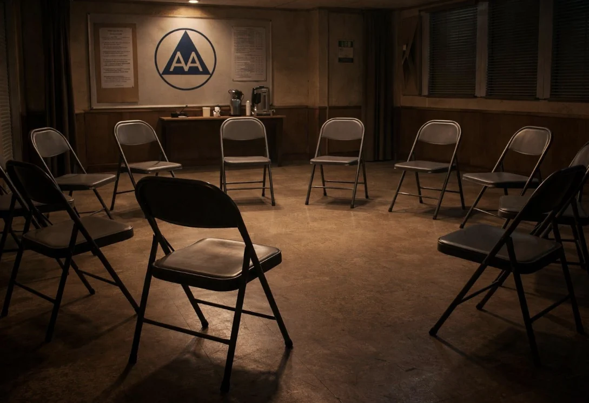{ loading=lazy decoding=async }

The 24-Hour International Marathon Meeting of A.A., *where sobriety never sleeps*, is dedicated to carrying A.A.'s life-saving message of hope and recovery globally to the alcoholic who still suffers. Individuals seeking support for drug problems and substance use disorders may benefit from professional treatment programs, government resources, rehabilitation services, family support organizations, and other recovery programs and fellowships. Alcoholics Anonymous is not affiliated with any outside agency or enterprise.

<a class="join-button" href="https://zoom.us/j/2923712604" target="_blank" rel="noopener">Join this 24/7 online A.A. meeting NOW</a>

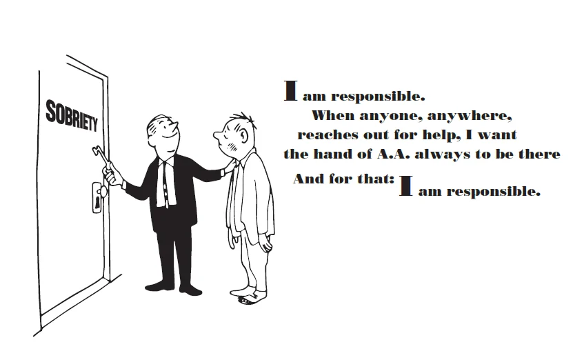{ loading=lazy decoding=async }

## Preamble of A.A.

Alcoholics Anonymous is a fellowship of people who share their experience, strength, and hope with each other so that they may solve their common problem and help others recover from alcoholism. The only requirement for membership is a desire to stop drinking. There are no dues or fees for A.A. membership; we are self-supporting through our own contributions. A.A. is not allied with any sect, denomination, politics, organization, or institution; does not wish to engage in any controversy, neither endorses nor opposes any causes. Our primary purpose is to stay sober and help other alcoholics achieve sobriety.

*Copyright by A.A. Grapevine, Inc.; reprinted with permission.*

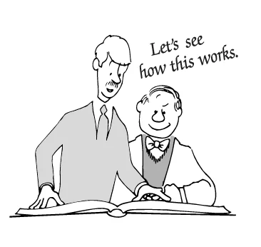{ loading=lazy decoding=async }

## The Twelve Steps of Alcoholics Anonymous

1. We admitted we were powerless over alcohol—that our lives had become unmanageable.
2. Came to believe that a Power greater than ourselves could restore us to sanity.
3. Made a decision to turn our will and our lives over to the care of God *as we understood Him*.
4. Made a searching and fearless moral inventory of ourselves.
5. Admitted to God, to ourselves, and to another human being the exact nature of our wrongs.
6. Were entirely ready to have God remove all these defects of character.
7. Humbly asked Him to remove our shortcomings.
8. Made a list of all persons we had harmed, and became willing to make amends to them all.
9. Made direct amends to such people wherever possible, except when to do so would injure them or others.
10. Continued to take personal inventory and when we were wrong promptly admitted it.
11. Sought through prayer and meditation to improve our conscious contact with God *as we understood Him*, praying only for knowledge of His will for us and the power to carry that out.
12. Having had a spiritual awakening as the result of these steps, we tried to carry this message to alcoholics, and to practice these principles in all our affairs.

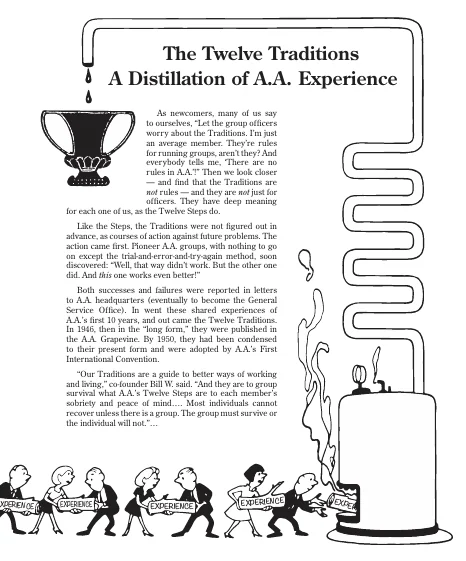{ loading=lazy decoding=async }

## The Twelve Traditions of Alcoholics Anonymous

1. Our common welfare should come first; personal recovery depends upon A.A. unity.
2. For our group purpose there is but one ultimate authority—a loving God as He may express Himself in our group conscience. Our leaders are but trusted servants; they do not govern.
3. The only requirement for A.A. membership is a desire to stop drinking.
4. Each group should be autonomous except in matters affecting other groups or A.A. as a whole.
5. Each group has but one primary purpose—to carry its message to the alcoholic who still suffers.
6. An A.A. group ought never endorse, finance, or lend the A.A. name to any related facility or outside enterprise, lest problems of money, property, and prestige divert us from our primary purpose.
7. Every A.A. group ought to be fully self-supporting, declining outside contributions.
8. Alcoholics Anonymous should remain forever nonprofessional, but our service centers may employ special workers.
9. A.A., as such, ought never be organized; but we may create service boards or committees directly responsible to those they serve.
10. Alcoholics Anonymous has no opinion on outside issues; hence the A.A. name ought never be drawn into public controversy.
11. Our public relations policy is based on attraction rather than promotion; we need always maintain personal anonymity at the level of press, radio, and films.
12. Anonymity is the spiritual foundation of all our Traditions, ever reminding us to place principles before personalities.

## Find A.A. Near You

  <a class="explore-button" href="https://www.aa.org/find-aa" target="_blank" rel="noopener">A.A. World Services</a>
  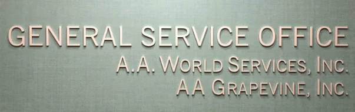

  <a class="explore-button" href="https://aa-intergroup.org/meetings/" target="_blank" rel="noopener">Online Intergroup of Alcoholics Anonymous</a>
  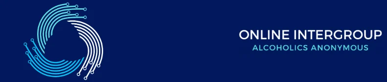

<em>Help is available. The links above can connect you with both in-person and online A.A. meetings. The A.A. World Services button leads to in-person meetings around the world. You can likely find a &quot;brick and mortar&quot; meeting in your local community. The Online Intergroup of Alcoholics Anonymous button leads to online meetings from around the world in many different languages.</em>

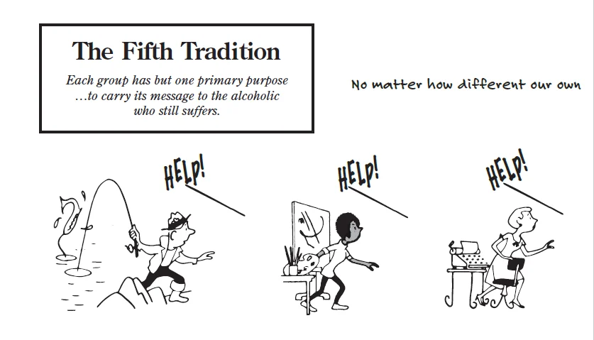{ loading=lazy decoding=async }

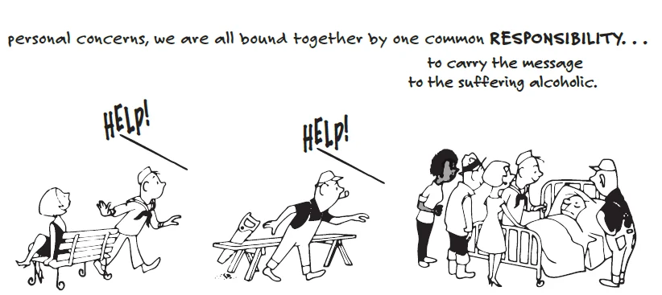{ loading=lazy decoding=async }

### A Declaration of Unity

  
Declaration of Unity

  
This we owe to A.A.'s future: To place our common welfare first; to keep our Fellowship united. For on A.A. unity depend our lives and the lives of those to come.

The Declaration was adopted by the Fellowship at the 35th International A.A. Convention at Miami in 1970.

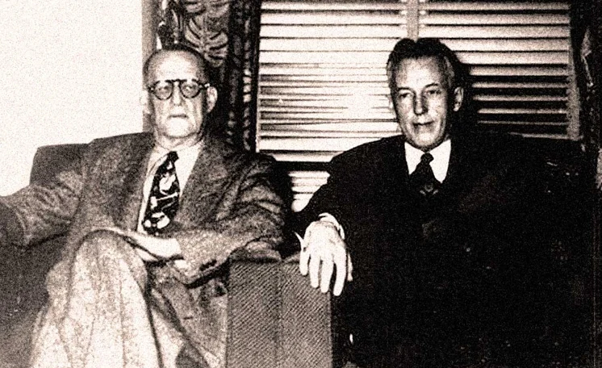{ loading=lazy decoding=async }

*Dr. Bob and Bill W., the cofounders of Alcoholics Anonymous*

### I Am Responsible

  
Toronto Responsibility Statement

  
I am responsible.

  
When anyone, anywhere, reaches out for help, I want the hand of A.A. always to be there. And for that I am responsible.

The responsibility statement was written for the 1965 International Convention in Toronto, and it remains a core principle of A.A. service today.

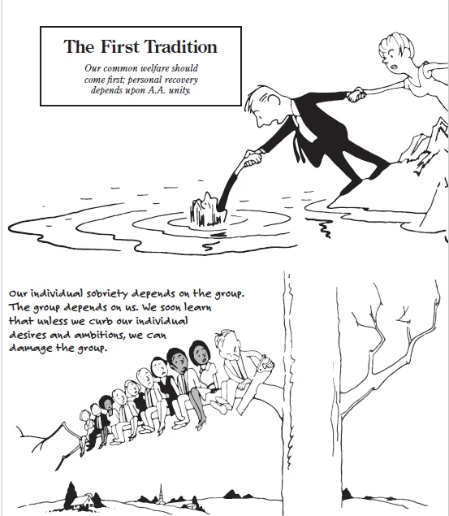{ loading=lazy decoding=async }

## Contact This 24/7 Online A.A. Meeting

This link will connect you with the 24-Hour International Marathon Meeting of A.A. (where sobriety never sleeps).

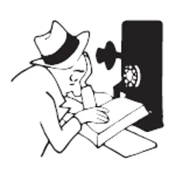{ loading=lazy decoding=async }

*We are available 24 hours a day on Zoom 292 371 2604. If you have any questions, or would like to get involved in service, click the link below.*

<a class="explore-button" href="contact-this-24-7-online-aa-meeting/">Contact the 24-Hour International Marathon Meeting of A.A.</a>

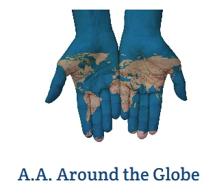{ loading=lazy decoding=async }

### International A.A. Websites

{ loading=lazy decoding=async }

*A.A. is a global Fellowship. Alcoholics Anonymous has known groups in 180 countries worldwide, with an estimated 2 million members, supported by more than 123,000 groups globally. The link below leads to many official international A.A. websites.*

<a class="explore-button" href="international-aa-websites/">Explore International A.A. Websites</a>

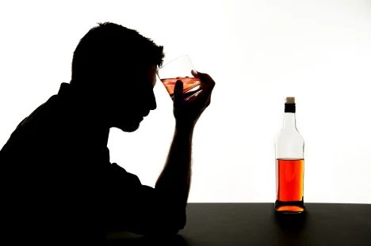{ loading=lazy decoding=async }

*The only requirement for A.A. membership is a desire to stop drinking. A.A. does not pronounce anyone as an alcoholic.*

## Do You Have a Drinking Problem?

### The CAGE Questionnaire

The CAGE questionnaire is a short, widely used screening tool designed to help individuals identify possible problems with alcohol use. Originally introduced by Dr. John A. Ewing, it is commonly used in clinical settings and is recognized by institutions such as Johns Hopkins University Hospital.

Please answer each question honestly with a yes or no.

- C — Cut down: Have you ever felt you should cut down on your drinking?
- A — Annoyed: Have people annoyed you by criticizing your drinking?
- G — Guilty: Have you ever felt bad or guilty about your drinking?
- E — Eye-opener: Have you ever had a drink first thing in the morning to steady your nerves or relieve a hangover?

Source: [Johns Hopkins University Hospital](https://www.hopkinsmedicine.org)

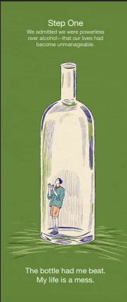{ loading=lazy decoding=async }

*Alcoholics are women and men who have lost the ability to control their drinking. Recovery begins when we concede to our innermost selves that we are alcoholics.*

### A.A.'s Two Questions

The book *Alcoholics Anonymous* (the Big Book) says that alcoholics are men and women who have lost the ability to control their drinking. A.A. does not pronounce anyone as being an alcoholic. The following passage from page 44 of the Big Book states: "In the preceding chapters you have learned something of alcoholism. We hope we have made clear the distinction between the alcoholic and the non-alcoholic. If, when you honestly want to, you find you cannot quit entirely, or if when drinking, you have little control over the amount you take, you are probably alcoholic. If that be the case, you may be suffering from an illness which only a spiritual experience will conquer."

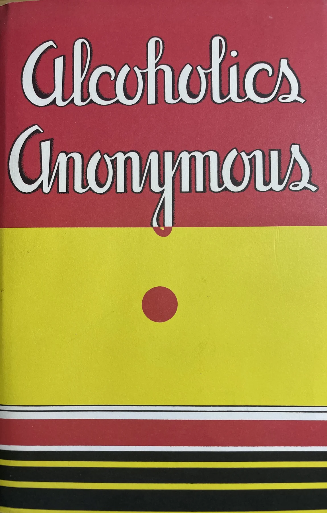{ loading=lazy decoding=async }

*First edition of the Big Book of Alcoholics Anonymous, published in April 1939. This is our basic text, which explains the nature of alcoholism and A.A.'s program of recovery—the Twelve Steps.*

## A.A. Literature

The button below leads to A.A. General Service Conference-approved literature.

<a class="explore-button" href="aa-literature/">Access A.A. General Service Conference-approved Literature</a>

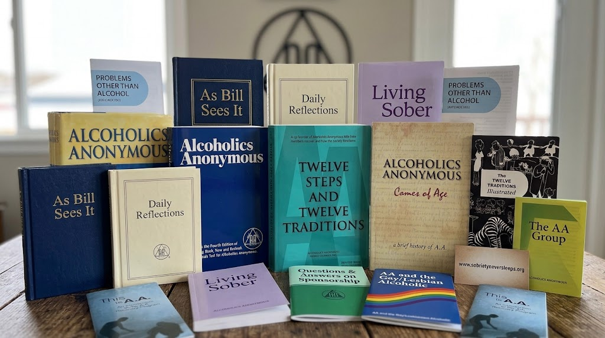{ loading=lazy decoding=async }

See also: <a href="aa-grapevine-and-la-vina/">A.A. Grapevine and La Viña</a> for member-written stories and insights.

<article class="legacy-vignette">
  <h3>Long Form of Tradition Six</h3>
  
Problems of money, property, and authority may easily divert us from our primary spiritual aim. We think, therefore, that any considerable property of genuine use to A.A. should be separately incorporated and managed, thus dividing the material from the spiritual. An A.A. group, as such, should never go into business. Secondary aids to A.A., such as clubs or hospitals which require much property or administration, ought to be incorporated and so set apart that, if necessary, they can be freely discarded by the groups. Hence such facilities ought not to use the A.A. name. Their management should be the sole responsibility of those people who financially support them. For clubs, A.A. managers are usually preferred. But hospitals, as well as other places of recuperation, ought to be well outside A.A.- and medically supervised. While an A.A. group may cooperate with anyone, such cooperation ought never go so far as affiliation or endorsement, actual or implied. An A.A. group can bind itself to no one.

</article>

{ loading=lazy decoding=async }

*Help is available! If you are facing a medical emergency, contact your local first responders. In Canada and the United States dial <strong>911</strong>, in Ireland dial <strong>112</strong>, in the UK dial <strong>999</strong>, in New Zealand dial <strong>111</strong>, in Australia dial <strong>000</strong>. Alcoholics Anonymous does not provide medical advice, emergency medical services or detox treatment.*

## Crisis and Mental Health Resources

Alcoholics Anonymous is not affiliated with any outside entities or organizations. The link below leads to non-A.A. crisis and mental health resources.

<a class="explore-button" href="crisis-resources/">Access Crisis and Mental Health Support</a>

Also explore: <a href="recovery-resources/">Substance Abuse and Drug Rehabilitation Resources</a> and <a href="topics-for-online-aa-meetings/">Meeting Topics</a> for peer support.

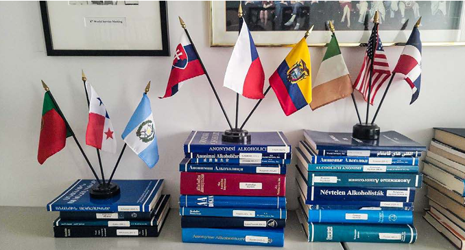{ loading=lazy decoding=async }

## Frequently Asked Questions About This 24/7 Online A.A. Meeting

Need quick answers before joining? Visit our dedicated FAQ page for common questions about the meeting, attendance, safety, anonymity, and participation.

<a class="explore-button" href="faq/">Browse Frequently Asked Questions</a>

Related: <a href="quick-answers/">Quick Answers</a> | <a href="what-to-expect-when-you-join/">What to Expect</a>

To join right away, use the Zoom ID **292 371 2604** or click a "Join this 24/7 online A.A. meeting NOW" button.

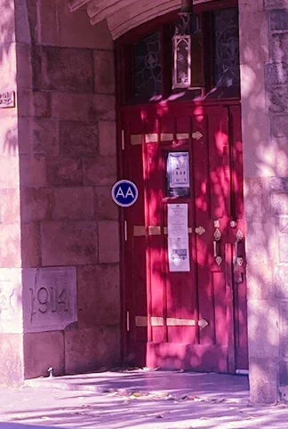{ loading=lazy decoding=async }

## Non-A.A. Recovery Resources

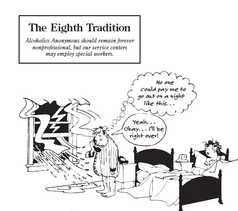{ loading=lazy decoding=async }

  
Long Form of Tradition Eight

  
Alcoholics Anonymous should remain forever nonprofessional. We define professionalism as the occupation of counseling alcoholics for fees or hire. But we may employ alcoholics where they are going to perform those services for which we might otherwise have to engage nonalcoholics. Such special services may be well recompensed. But our usual A.A. Twelfth Step work is never to be paid for.

The link below leads to a variety of non-A.A. recovery-related resources. Inclusion on this website does not indicate endorsement or affiliation. Our aim is to be helpful and to cooperate with our friends.

<a class="explore-button" href="recovery-resources/">Non-A.A. Substance Abuse and Rehabilitation Resources</a>

Complement with: <a href="crisis-resources/">Crisis and Mental Health Resources</a>

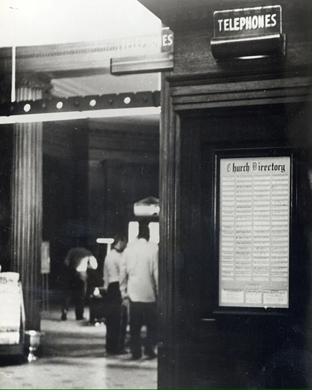{ loading=lazy decoding=async }

*The church directory in the lobby of the Mayflower Hotel in Akron, Ohio that led Bill W. to Dr. Bob. The two men went on to co-found Alcoholics Anonymous.*

*Alcoholics Anonymous began in Akron, Ohio, in June 1935, when Bill W., a New York stockbroker, met Dr. Bob, an Akron physician. Early A.A. pioneers gathered in Dr. Bob's house and drank from this coffee pot, as they shared their experience, strength and hope.*

## A.A.'s Primary Purpose

Our Twelfth Step—carrying the message—is the basic service that the A.A. Fellowship gives; this is our principal aim and the main reason for our existence. Therefore, A.A. is more than a set of principles; it is a society of alcoholics in action. We must carry the message, else we ourselves can wither and those who have not been given the truth may die.

<a class="explore-button" href="aa-primary-purpose/">Read About A.A.'s Primary Purpose</a>

Connection: <a href="aas-three-legacies/">A.A.'s Three Legacies</a> provide the framework for the primary purpose of carrying the A.A. message of hope and recovery to the alcoholic who still suffers.

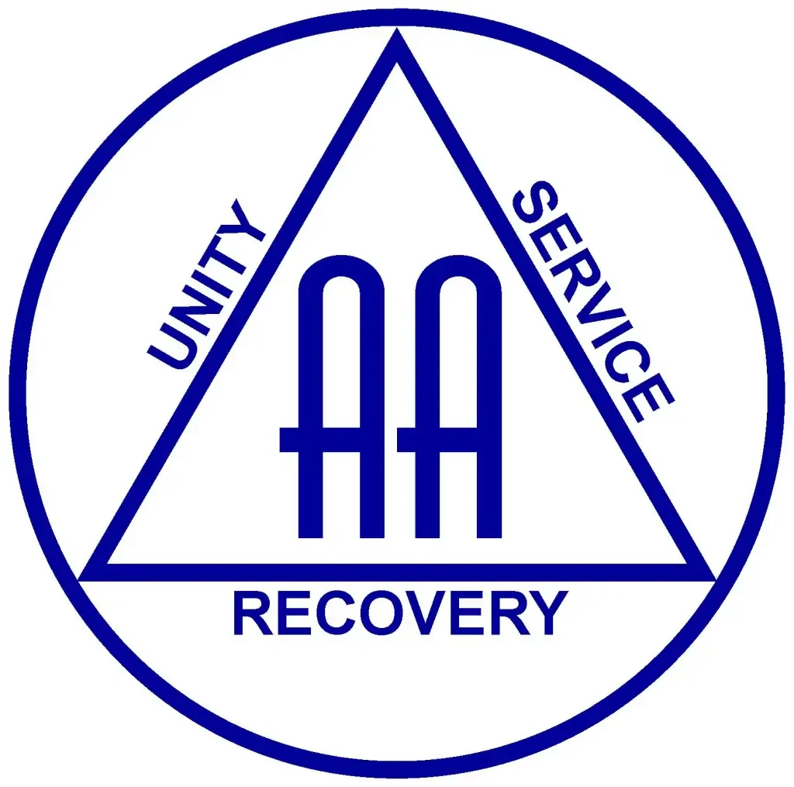{ loading=lazy decoding=async }

## A.A.'s Three Legacies: Recovery, Unity, and Service

The Three Legacies of Alcoholics Anonymous are Recovery, Unity, and Service. By the first, we recover from alcoholism; by the second, we stay together in unity; and by the third, our society functions and serves its primary purpose of carrying the A.A. message to all who need it and want it. (*Alcoholics Anonymous Comes of Age: A Brief History of A.A.*)

<a class="explore-button" href="aas-three-legacies/">Read About A.A.'s Three Legacies</a>

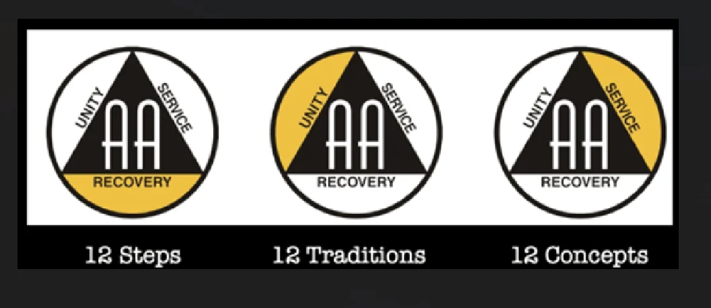{ loading=lazy decoding=async }

*A.A.'s Three Legacies of Recovery, Unity, and Service were adopted by the Fellowship at the International Convention of Alcoholics Anonymous at St. Louis in 1955. Read about this historic event in the book Alcoholics Anonymous Comes of Age: A Brief History of A.A.*

## Sponsorship in A.A.

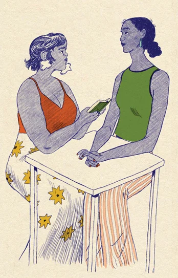{ loading=lazy decoding=async }

*Sponsorship, with its continuing interest in another alcoholic, often develops when the prospect is willing to be helped, admits having a drinking problem, and decides to seek sobriety as a solution.*

<a class="explore-button" href="sponsorship/">Sponsorship</a>

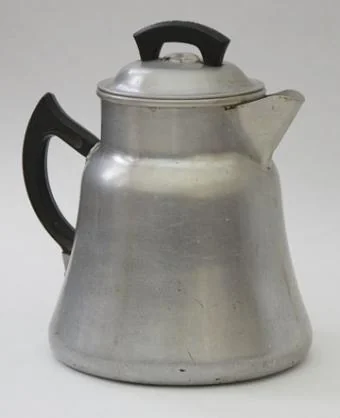{ loading=lazy decoding=async }

## The A.A. Group...Where It All Begins

### What is an A.A. group?

Any gathering of two or more alcoholics who wish to recover and have no other affiliation may call themselves an A.A. group. Membership at the group level is open to all who have a desire to recover from alcoholism. There are no dues, fees, requirements or restrictions of any kind. There's no formal application to join a group.

### What is the purpose of an A.A. group?

All groups exist to help those who suffer from the disease of alcoholism.

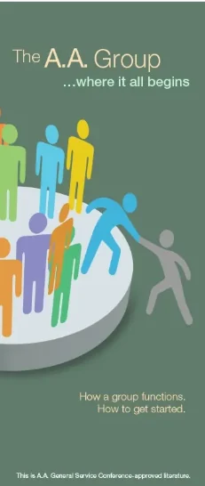{ loading=lazy decoding=async }

<em>The A.A. Group...Where It All Begins</em>

This informational guide tells how a group works most effectively, how a new group can be started, and how each group can be linked to A.A. as a whole. General Service Conference-approved.

<a class="explore-button" href="https://www.aa.org/aa-groupwhere-it-all-begins" target="_blank" rel="noopener">Read the pamphlet &quot;The A.A. Group...Where It All Begins&quot; from A.A. World Services</a>

## Problems Other Than Alcohol

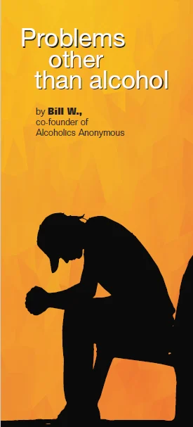{ loading=lazy decoding=async }

The problem of drug addiction in its several forms lies close to us all. It stirs our deepest interest and sympathy. Many A.A. members, especially those who have suffered these particular addictions, are now asking, "What can we do about drugs—within our Fellowship, and without?" Bill W. wrote these words in the pamphlet *Problems Other Than Alcohol*.

<a class="explore-button" href="problems-other-than-alcohol/">Read the pamphlet &quot;Problems Other Than Alcohol&quot; by Bill W. from A.A. World Services</a>

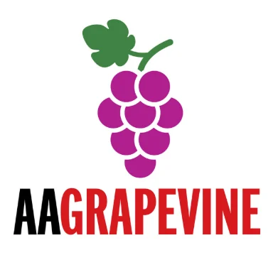{ loading=lazy decoding=async }

*The Grapevine is A.A.'s "meeting in print." La Viña is the Fellowship's Spanish-language magazine. Both publications include submissions from ordinary A.A. members from around the world.*

## A.A. Grapevine and La Viña

<a class="explore-button" href="aa-grapevine-and-la-vina/">Read A.A. Grapevine and La Viña Publications</a>

Explore: <a href="aa-literature/">A.A. Literature</a> | <a href="topics-for-online-aa-meetings/">Meeting Topics</a>

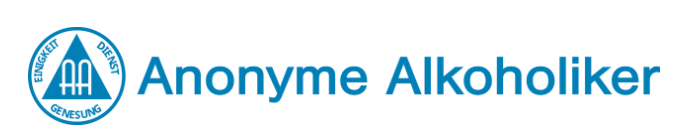{ loading=lazy decoding=async }

## About This Meeting

The link below provides relevant information concerning the 24-Hour International Marathon Meeting of A.A. (where sobriety never sleeps).

<a class="explore-button" href="about-this-meeting/">Learn More About This 24-Hour International Marathon Meeting</a>

Connect with: <a href="aas-three-legacies/">A.A.'s Three Legacies</a> | <a href="aa-primary-purpose/">Primary Purpose</a>

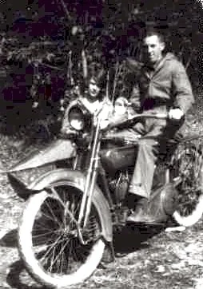{ loading=lazy decoding=async }

*A.A.'s cofounder, Bill W., and his wife Lois in 1925.*

## A.A. World Services and A.A. General Service Office

<a class="explore-button" href="https://www.aa.org" target="_blank" rel="noopener">Contact the A.A. General Service Office (GSO)</a>

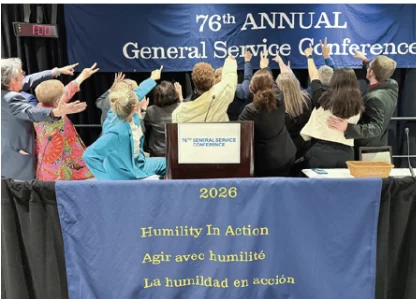{ loading=lazy decoding=async }

*The General Service Conference of A.A. has become, for nearly every practical purpose, the active voice and the effective conscience of our whole society in its world affairs.*

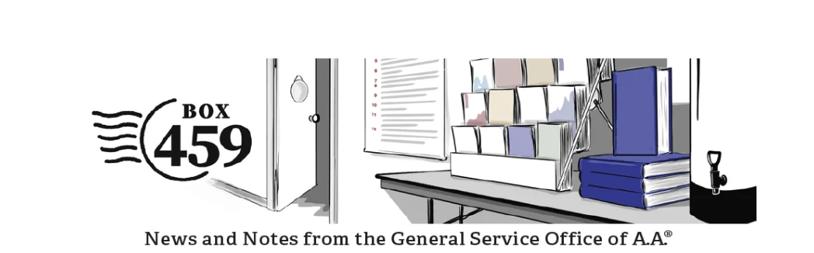{ loading=lazy decoding=async }

*Box 459 is the official newsletter of the A.A. General Service Office.*

## Box 459

Join our Box 459 newsletter digital delivery mailing list.

<a class="explore-button" href="https://www.aa.org/box-459" target="_blank" rel="noopener">Subscribe to Box 459 Newsletter</a>

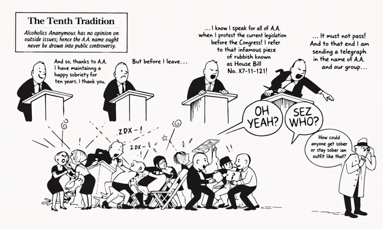

## Disclaimer and Permissions

For the full legal notice, permissions, and related guidance, see the page below.

<a class="explore-button" href="disclaimer-and-permissions/">Read Our Disclaimer and Permissions</a>

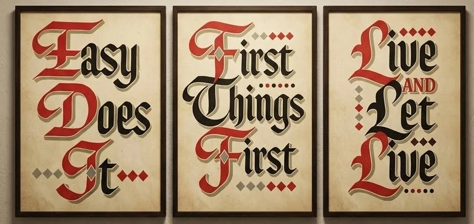{ loading=lazy decoding=async }

*Alcoholics Anonymous has many slogans and mottoes that help our members stay away from the first drink—one day at a time.*

<a class="join-button" href="https://zoom.us/j/2923712604" target="_blank" rel="noopener">Join this 24/7 online A.A. meeting NOW</a>

---

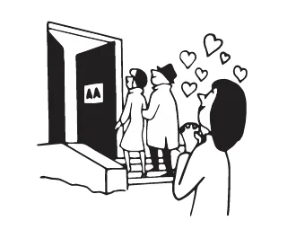{ loading=lazy decoding=async }

## Quick Links and Resources

  

    <h4>Getting Started</h4>
    <ul class="quick-links-list">
      <li><a href="what-to-expect-when-you-join/">What to Expect</a></li>
      <li><a href="quick-answers/">Quick Answers</a></li>
      <li><a href="faq/">Frequently Asked Questions</a></li>
      <li><a href="contact-this-24-7-online-aa-meeting/">Contact Us</a></li>
    </ul>
  

  

    <h4>A.A. Foundation</h4>
    <ul class="quick-links-list">
      <li><a href="aa-primary-purpose/">Primary Purpose</a></li>
      <li><a href="aas-three-legacies/">Three Legacies</a></li>
      <li><a href="aa-literature/">Conference-Approved Literature</a></li>
      <li><a href="international-aa-websites/">International Websites</a></li>
    </ul>
  

  

    <h4>Support & Resources</h4>
    <ul class="quick-links-list">
      <li><a href="topics-for-online-aa-meetings/">Meeting Topics</a></li>
      <li><a href="crisis-resources/">Crisis Resources</a></li>
      <li><a href="recovery-resources/">Recovery Programs</a></li>
      <li><a href="aa-grapevine-and-la-vina/">Grapevine & La Viña</a></li>
    </ul>
  

  

    <h4>About & Legal</h4>
    <ul class="quick-links-list">
      <li><a href="about-this-meeting/">About This Meeting</a></li>
      <li><a href="disclaimer-and-permissions/">Disclaimer</a></li>
      <li><a href="https://www.aa.org" target="_blank" rel="noopener">A.A. World Services</a></li>
    </ul>
  

---

## Serenity Prayer

<blockquote class="serenity-prayer">
God, grant me the <strong>Serenity</strong> to accept the things I cannot change, 
<strong>Courage</strong> to change the things I can, 
and <strong>Wisdom</strong> to know the difference.
</blockquote>
